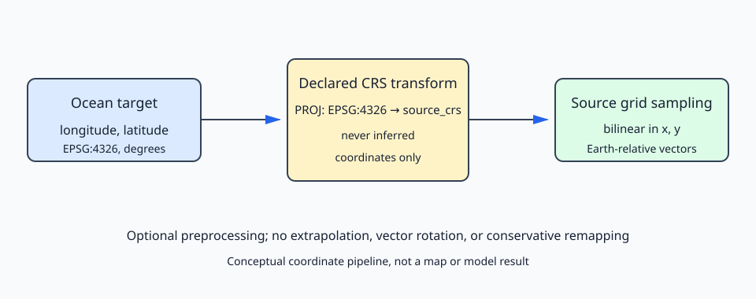
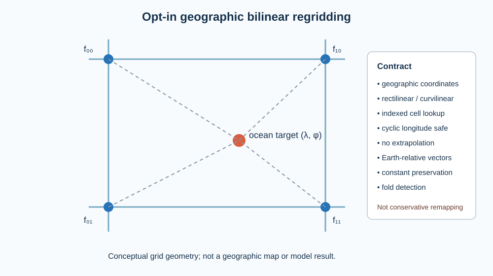
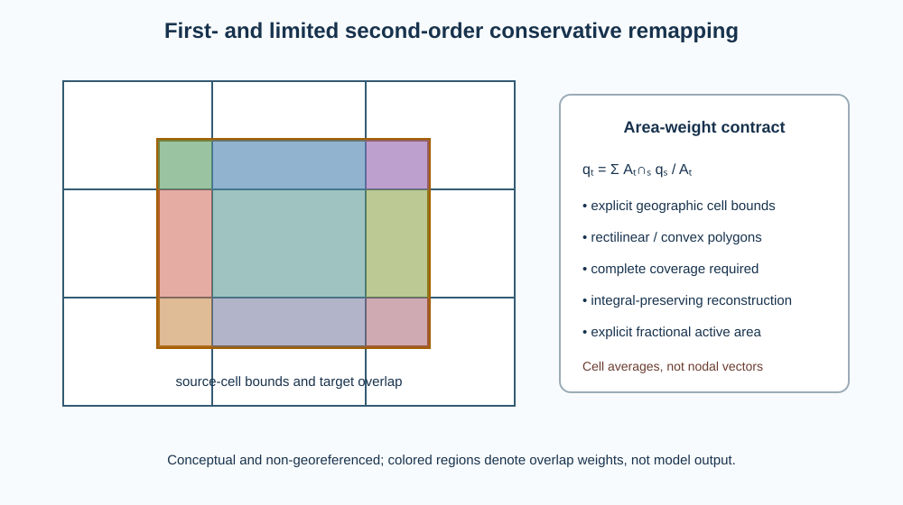

# Ocean adapters

Adapters normalize ocean time, vertical levels, mask, longitude, latitude, bathymetry, sea-surface height, velocity, and diffusivity onto the particle grid. They never reverse time or velocity. The solver owns tracking direction.

The implemented adapters are ROMS, native WACOMM, NEMO, and HYCOM. Adapter selection is explicit and an unknown name fails; no fallback chooses a different model silently.

ROMS velocity is normalized from its Arakawa C-grid staggering to the rho-point particle grid without changing units or sign. For every wet rho point, `U_rho(j,i)` is the arithmetic mean of the valid wet faces `U(j,i)` and `U(j,i-1)`, while `V_rho(j,i)` is the mean of `V(j,i)` and `V(j-1,i)`. A domain edge with one available face uses that face rather than halving it against an invented zero; a land rho point is zero. Thus velocity remains in meters per second and the adapter performs spatial normalization only. The runtime ROMS fixture checks interior and all four edge mappings on the staggered dimensions described by Shchepetkin and McWilliams (2005).

Native WACOMM files use the `xi_rho` horizontal dimension written by the current serializer. The loader also accepts the historical `eta_xi` spelling for restart/input compatibility. Native and ROMS time coordinates must be strictly chronological, matching the NEMO/HYCOM contract.

NEMO recognizes `nav_lon/longitude/lon`, `nav_lat/latitude/lat`, `time_counter/time`, `uo/vozocrtx/u`, `vo/vomecrty/v`, `wo/vovecrtz/w`, `zos/sossheig/ssh`, `avt/votkeavt/akt`, and `deptht/depth`. HYCOM recognizes `lon/longitude`, `lat/latitude`, `time/MT`, `water_u/u`, `water_v/v`, `surf_el/ssh/zeta`, `water_w/w`, `diffusivity/akt`, and `bathymetry`. HYCOM longitudes greater than 180 degrees are normalized by subtracting 360 degrees.

The initial NEMO implementation accepts products whose U and V fields already share the particle grid. It detects and rejects unsupported staggered or inconsistent dimensions. Input time must be strictly chronological. Positive-down depth may be stored shallow-to-deep or deep-to-shallow, but must be strictly monotonic; the adapter maps depth and every dynamic vertical field together onto WaComM's bottom-to-surface logical indices. Missing W or AKT fields use zero with a warning; this excludes resolved vertical transport or turbulent vertical diffusion and must be considered in scientific interpretation.

Run `ctest --test-dir build -R "roms_adapter|native_adapter|structured_grid_adapters" --output-on-failure` after configuring an application build. The fixtures are generated at runtime and require NetCDF C++4. Failures normally indicate an unsupported dimension layout, a non-chronological time axis, or a mismatch between coordinates and velocity dimensions. Adapter fixture success verifies normalization, not the scientific suitability or resolution of a forcing product.

Atmospheric and wave inputs are deliberately independent of the ocean adapter family. `WeatherModelAdapter` and `WeatherModelAdapterFactory` expose generic chronological time, longitude, latitude, and eastward/northward 10 m wind fields. The `WRFAdapter` reads `U10`, `V10`, `XLONG`, `XLAT`, `COSALPHA`, `SINALPHA`, and either absolute numeric `time` or `Times`. Native grid-relative wind is rotated to Earth-relative components using `u_e=U10 cos(alpha)-V10 sin(alpha)` and `v_n=V10 cos(alpha)+U10 sin(alpha)` before it reaches drift physics.

`WaveModelAdapter` and `WaveModelAdapterFactory` expose the corresponding generic surface Stokes velocity. The `WW3Adapter` accepts chronological `time`, one- or two-dimensional longitude/latitude, and the component aliases `uuss/vuss`, `ust/vst`, `stokes_u/stokes_v`, `eastward_surface_stokes_drift/northward_surface_stokes_drift`, or `sea_surface_wave_stokes_drift_x_velocity/sea_surface_wave_stokes_drift_y_velocity`, all in m s-1. The last two pairs improve interoperability with CF-oriented products and OpenDrift reader conventions without coupling WaComM++ to OpenDrift. Longitude above 180 degrees is normalized to the `[-180,180]` convention.

The present coupling requires each environmental forcing list to contain one dataset per ocean forcing window. A dataset may be a local NetCDF path or an explicit HTTP, HTTPS, or DAP4 URI supported by the linked NetCDF library. Windows are opened on demand in physical traversal order. Only the current and adjacent window are retained; the already-normalized adjacent adapter becomes the next current adapter rather than reopening the remote dataset. This bounds application-level residency and preserves the identical normalization and solver path for local, forward, backward, serial, OpenMP, and MPI execution. NetCDF remains responsible for protocol transfer and its internal chunk cache.

After the same chronological boundary-record assembly used by ocean forcing, weather and wave times and coordinates must match the normalized ocean particle grid within declared numerical tolerances. The application fails if a URI is unavailable or regridding would be required; it never treats unequal grids as coincident or substitutes a fallback source. ROMS, NEMO, HYCOM, native WACOMM, WRF, and WW3 adapters never reverse time or velocity. Direction remains solver policy.

Environmental metadata are part of the adapter contract. WRF and WW3 horizontal velocities must declare units equivalent to `m s-1`; longitude and latitude must declare `degrees_east` and `degrees_north`, respectively. Numeric environmental time must use a supported Gregorian calendar and CF-style units in seconds, minutes, hours, or days since a UTC reference date. Missing, non-finite, ambiguous, or unsupported metadata cause an error rather than an implicit scale conversion. WRF character `Times` remains supported because it carries an explicit `YYYY-MM-DD_HH:MM:SS` timestamp.

If `τ` is the numeric coordinate, `sU` is its unit scale in seconds, `t0` is the declared reference instant, and `tW` is the WaComM epoch, normalization is

$$
t_{\mathrm{WaComM}}=(t_0-t_W)+s_U\tau .
$$

This is representation normalization only. It does not reorder records or change tracking direction. The first implementation supports `standard`, `gregorian`, and `proleptic_gregorian` calendars for modern forcing dates and rejects non-Gregorian model calendars until their chronology is implemented explicitly.

## Geographic regridding

Environmental regridding is disabled by default. Setting `regrid` to `bilinear_geographic` applies an explicit interpolation operator only when the environmental source grid is rectilinear in longitude and latitude with strictly monotonic axes. `bilinear_curvilinear_geographic` first queries a uniform bounding-box spatial index, then locates the target inside each candidate non-folded quadrilateral by Newton inversion of the bilinear coordinate map and applies the same four nodal weights. The index changes candidate discovery only; interpolation weights and vector treatment are unchanged. Every ocean-grid target must lie inside a valid source cell; extrapolation is prohibited. Product adapters first normalize vectors to eastward and northward components, after which both components use identical scalar weights.

With `USE_PROJ=ON`, `bilinear_projected` accepts declared projected WRF or WW3 grids containing rectilinear axes or valid curvilinear `x/y` meshes in meters. Ocean targets are transformed from EPSG:4326 into `source_crs`, then bracketed on rectilinear axes or located through the non-cyclic spatial index and inverse-bilinear solve. WRF still uses `COSALPHA/SINALPHA` to rotate U10/V10 into east/north before interpolation; projected WW3 components must already be eastward/northward. Coordinate transformation never serves as vector rotation.

The schema is conceptual rather than a map or model result. It distinguishes coordinate transformation from interpolation and vector-basis normalization.

For normalized source-cell coordinates `ξ,η∈[0,1]`, each component is evaluated as

$$
f(\xi,\eta)=(1-\xi)(1-\eta)f_{00}+\xi(1-\eta)f_{10}+(1-\xi)\eta f_{01}+\xi\eta f_{11}.
$$

The rectilinear operator preserves constant fields and is exact for fields affine in its coordinate axes; the curvilinear operator preserves constants and fields bilinear in its local cell coordinates. These properties are regression-tested. A longitude axis or cell crossing the antimeridian is unwrapped onto a local continuous branch. Increasing and decreasing rectilinear axes are both supported. Folded or singular curvilinear cells are rejected. Bilinear interpolation is not locally or globally conservative and introduces smoothing whose magnitude depends on unresolved curvature and scale separation. It is appropriate for point-sampled wind and Stokes velocity when this limitation is scientifically acceptable. It must not be described as conservative flux remapping. Extrapolation, unavailable datum resources, and rotation from an unknown vector basis remain unsupported and fail explicitly. Projected geometry uses Cartesian coordinates without longitude wrapping. Index construction is linear in source-cell count; lookup may approach a full scan for highly overlapping bounds.

## Conservative cell-average remapping

WaComM++ also provides distinct conservative operators for extensive-density or cell-average scalar fields on rectilinear or convex-curvilinear longitude/latitude grids. They are intentionally absent from WRF and WW3 velocity configuration: a point-sampled vector component is not a cell-integrated scalar, and component-wise conservation would not establish conservation of vector flux.

For source cell means $q_s$ and target cell $T$, the remapped mean is

$$
q_T=\frac{1}{A_T}\sum_s A_{T\cap s}q_s,\qquad
A([\lambda_w,\lambda_e]\times[\phi_s,\phi_n])
=R^2(\lambda_e-\lambda_w)(\sin\phi_n-\sin\phi_s),
$$

where $A_T$ and $A_{T\cap s}$ are target and overlap areas in m², $R$ is the consistently cancelled spherical radius in m, longitude $\lambda$ and latitude $\phi$ are in radians, and $q$ retains the input cell-average units. The implementation uses the dimensionless area factor because $R^2$ cancels exactly. Every target cell must be completely and uniquely covered; gaps, overlap, and extrapolation fail.

For curvilinear cells the operator defines edges as straight segments in the local equal-area coordinates $x=\lambda$ and $y=\sin\phi$, clips convex quadrilaterals, and evaluates polygon area and centroid in that plane. Antimeridian coordinates are placed on one explicitly local branch; global cells, non-convex/folded cells, and edges ambiguous by 180 degrees are rejected. A supplied active fraction $f_s\in[0,1]$ multiplies the extensive source contribution. A zero-fraction cell may contain a non-finite placeholder because it contributes exactly zero; active cells must be finite. The target mean remains normalized by full target area, so inactive source fraction represents zero extensive content rather than missing coverage.

The optional limited second-order reconstruction is

$$
q_s(x,y)=\bar q_s+\alpha_s\nabla q_s\boldsymbol{\cdot}\left[(x,y)-(x_s,y_s)\right],
$$

where $\bar q_s$ is the source cell mean, $(x_s,y_s)$ its equal-area centroid, $\nabla q_s$ a dimensioned least-squares gradient with respect to $x$ and $y$, and the dimensionless $\alpha_s\in[0,1]$ limits reconstructed source vertices to the extrema of active edge-neighbors. Integrating about the source centroid makes the linear correction integrate to zero over the complete source cell; therefore the common-domain extensive integral is preserved. First order preserves constants but not gradients. Second order reproduces an unlimited linear field where the limiter is inactive, but extrema, masks, boundaries, distorted cells, and insufficient neighbors reduce local order. Polygon construction is linear in grid size and the current deterministic all-pairs clipping is $O(N_sN_t)$ in source and target cell counts; no performance claim is made for global production meshes. Projected grids and vector-flux rotation remain unsupported.

The figure is a conceptual, non-georeferenced schema rather than a model result. It distinguishes overlap-area weights from nodal bilinear weights.

As a reproducible verification example, `tests/EnvironmentalRegridderTest.cpp` aggregates four 1° source-cell means onto one 2° target cell. It also refines the central cell of a 3×3 grid, verifies a linear longitude field under second-order reconstruction, compares first- and second-order integrals, applies a fractional mask, and rejects folded and uncovered geometry. Configure and execute it with `cmake -S . -B build && cmake --build build && ctest --test-dir build -R environmental_regridding --output-on-failure`. Passing establishes these numerical identities within the asserted tolerances, not observational validity for an environmental product.

## Reusing saved native boundary records

Native files saved from a multi-file run can already include the adjacent boundary record. The shared `OceanModelAdapter::appendBoundaryRecord` first applies its existing horizontal/vertical grid compatibility checks. If the incoming record time equals the relevant existing endpoint exactly, it retains that endpoint only when surface elevation, both horizontal velocities, vertical velocity, and vertical diffusivity agree numerically at every stored cell/level (zero absolute and relative tolerance). Conflicting values fail explicitly; other overlapping/nonchronological records remain errors. A later or earlier new boundary follows the existing append/prepend path. No velocity sign, time unit, calendar, interpolation weight, or tracking policy changes. The solver chooses which endpoint is needed.

The [Sarno native-forcing scaling example](../examples/wacomm-sarno-lite.md#mpiopenmp-strong-scaling) uses the original `processed-6h/` files directly with `save_input=false`; no file rewriting or implicit regridding is required. Native regression fixtures check forward and backward endpoint reuse, rejection of conflicts in each of the five dynamic fields, and forward/backward restart equivalence. All execution backends use this shared operator.

The native adapter accepts both `WACOMM` and the historical documented spelling `WaComM`; both select the same implementation and field conventions.

## References

- Shchepetkin, A. F., and McWilliams, J. C. (2005). The regional oceanic modeling system (ROMS): a split-explicit, free-surface, topography-following-coordinate oceanic model. *Ocean Modelling*, 9, 347–404. [doi:10.1016/j.ocemod.2004.08.002](https://doi.org/10.1016/j.ocemod.2004.08.002).
- Bleck, R. (2002). An oceanic general circulation model framed in hybrid isopycnic-Cartesian coordinates. *Ocean Modelling*, 4, 55–88. [doi:10.1016/S1463-5003(01)00012-9](https://doi.org/10.1016/S1463-5003(01)00012-9).
- Dagestad, K.-F., Röhrs, J., Breivik, Ø., and Ådlandsvik, B. (2018). OpenDrift v1.0: a generic framework for trajectory modelling. *Geoscientific Model Development*, 11, 1405–1420. [doi:10.5194/gmd-11-1405-2018](https://doi.org/10.5194/gmd-11-1405-2018).
- Powers, J. G., et al. (2017). The Weather Research and Forecasting Model: overview, system efforts, and future directions. *Bulletin of the American Meteorological Society*, 98, 1717–1737. [doi:10.1175/BAMS-D-15-00308.1](https://doi.org/10.1175/BAMS-D-15-00308.1).
- Tolman, H. L. (1991). A third-generation model for wind waves on slowly varying, unsteady, and inhomogeneous depths and currents. *Journal of Physical Oceanography*, 21, 782–797. [doi:10.1175/1520-0485(1991)021%3C0782:ATGMFW%3E2.0.CO;2](https://doi.org/10.1175/1520-0485(1991)021%3C0782:ATGMFW%3E2.0.CO;2).
- Hassell, D., Gregory, J., Blower, J., Lawrence, B. N., and Taylor, K. E. (2017). A data model of the Climate and Forecast metadata conventions (CF-1.6) with a software implementation (cf-python v2.1). *Geoscientific Model Development*, 10, 4619–4646. [doi:10.5194/gmd-10-4619-2017](https://doi.org/10.5194/gmd-10-4619-2017).
- Jones, P. W. (1999). First- and second-order conservative remapping schemes for grids in spherical coordinates. *Monthly Weather Review*, 127, 2204–2210. [doi:10.1175/1520-0493(1999)127%3C2204:FASOCR%3E2.0.CO;2](https://doi.org/10.1175/1520-0493%281999%29127%3C2204%3AFASOCR%3E2.0.CO%3B2).
- Barth, T. J., and Jespersen, D. C. (1989). The design and application of upwind schemes on unstructured meshes. *27th Aerospace Sciences Meeting*. [doi:10.2514/6.1989-366](https://doi.org/10.2514/6.1989-366).
- Karney, C. F. F. (2013). Algorithms for geodesics. *Journal of Geodesy*, 87, 43–55. [doi:10.1007/s00190-012-0578-z](https://doi.org/10.1007/s00190-012-0578-z).
