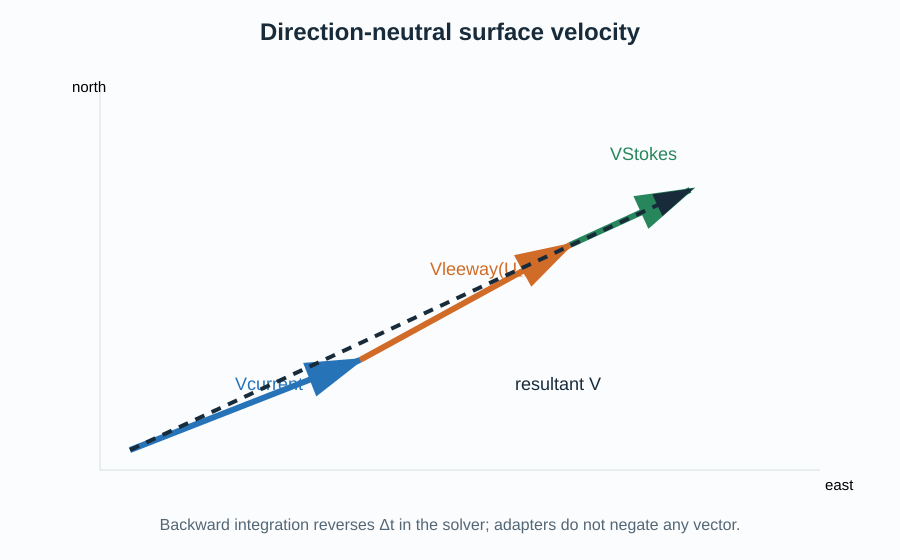

# Physical and numerical model

A particle state is the fractional grid position `(k,j,i)`, health, age, emission time, stable 64-bit identity, drift-object type, and crosswind orientation. Resolved velocity supplied by an ocean adapter advances position through the local horizontal great-circle metrics and normalized vertical coordinate. A configured surface-object model may add direction-neutral leeway before temporal orientation is applied. Dynamic fields are sampled on the adapter's common particle grid. Horizontal, upper, and lower closure modes are constraint, kill, or reflection.

Horizontal interpolation uses the origin cell `(floor(j),floor(i))`, so coordinates below zero are outside rather than aliases of cell zero. For normalized vertical position `k<=0`, let `ku=ceil(k)` and `beta=ku-k`. A W-level quantity is interpolated as `(1-beta) F(ku)+beta F(ku-1)`, where `0<=beta<1`; U and V use the containing rho level. Logical level `-N+1...0` maps to contiguous storage index `logical+N-1`. A source at the sea surface maps to logical level zero, while a requested depth below bathymetry maps to the lowest valid particle level. Velocity is in meters per second, horizontal metric distances and bathymetry are in meters, sea-surface height is in meters, and AKT is in square meters per second.

A horizontal candidate outside `[0,eta_rho-1) x [0,xi_rho-1)` follows the configured closure: constraint retains horizontal position, kill marks the particle dead, and reflection mirrors the coordinate at the domain edge. Reflection folds leaps spanning multiple domain widths and keeps an exact upper-edge result inside the final interpolation cell. Candidate coastline depth uses bilinearly interpolated `h+zeta` and the same `shore_limit` in every backend.

The configured `dti` is the maximum integration step in seconds. Each interval uses adjacent physical `ocean_time` values and a shortened final step lands on the interval boundary. Concentration evaluated after integration is stored at that physical endpoint, including for backward intervals. Deterministic forward motion has positive time orientation; deterministic backward motion reverses resolved velocity and terminal settling/rise displacement. Diffusion is a zero-mean stochastic displacement. A shortened step scales stochastic amplitude by the square root of elapsed time so variance remains proportional to time.

For a surface object, the horizontal deterministic velocity is `V_current + V_leeway + V_stokes`. The leeway term is the sum of downwind and crosswind linear regressions against 10 m wind speed; its mathematical statement, coefficient units, empirical scope, and catalog provenance are given in [sar-drift.md](sar-drift.md). Optional surface Stokes components are supplied directly in m s-1 by a wave adapter. Neither term contains a direction branch: forward and backward integrations use the same physical velocity, and the solver multiplies the complete deterministic displacement by `trackingDirection`.

An optional leeway coefficient ensemble adds one downwind and one crosswind Gaussian regression residual per particle. Their configured correlation is imposed by a two-dimensional Cholesky factor and their marginal catalog standard deviations remain unchanged. A separate side ensemble samples one initial left/right orientation from an explicitly configured Bernoulli prior. Optional isotropic wind uncertainty adds independent Gaussian errors, in m s-1, to the Earth-relative wind components at each substep. Coefficient residuals remain fixed; wind errors vary by physical interval and absolute substep; the resolved side remains fixed unless an optional constant-hazard jibing draw flips it after a completed substep. Disjoint counter keys make these realizations independent of rank, thread, and accelerator scheduling.

The physical-time interpolation weight between forcing records is `alpha=(t-T0)/(T1-T0)`, clamped to `[0,1]`; dynamic `u`, `v`, `w`, `zeta`, and `AKT` use that bracket, while static grid data do not. Each integration substep samples this interpolation at its physical midpoint, making the temporal integral exact when a dynamic field is linear between records. Irregular forcing intervals therefore retain their actual timestamps. At a file boundary the solver loads only the adjacent file, validates its horizontal and vertical grid, and appends or prepends the single physical boundary record. It never invents a nominal interval after the last available timestamp.

Backward deterministic integration can test trajectory reversibility when diffusion, decay, sources, and non-reversible boundary interactions are disabled. Stochastic backtracking is not an inverse random path; it represents candidate origins conditional on circulation data and modeling assumptions. Closures, finite resolution, missing forcing variables, interpolation, and numerical precision limit interpretation.

## References

- Montella, R., et al. (2023). A highly scalable high-performance Lagrangian transport and diffusion model for marine pollutants assessment. *Proceedings of PDP 2023*, 17–26. [doi:10.1109/PDP59025.2023.00012](https://doi.org/10.1109/PDP59025.2023.00012).
- Dagestad, K.-F., Röhrs, J., Breivik, Ø., and Ådlandsvik, B. (2018). OpenDrift v1.0: a generic framework for trajectory modelling. *Geoscientific Model Development*, 11, 1405–1420. [doi:10.5194/gmd-11-1405-2018](https://doi.org/10.5194/gmd-11-1405-2018).
- Breivik, Ø., and Allen, A. A. (2008). An operational search and rescue model for the Norwegian Sea and the North Sea. *Journal of Marine Systems*, 69, 99–113. [doi:10.1016/j.jmarsys.2007.02.010](https://doi.org/10.1016/j.jmarsys.2007.02.010).
- Visser, A. W. (1997). Using random walk models to simulate the vertical distribution of particles in a turbulent water column. *Marine Ecology Progress Series*, 158, 275–281. [doi:10.3354/meps158275](https://doi.org/10.3354/meps158275).
- Thygesen, U. H. (2011). How to reverse time in stochastic particle tracking models. *Journal of Marine Systems*, 88, 159–168. [doi:10.1016/j.jmarsys.2011.03.009](https://doi.org/10.1016/j.jmarsys.2011.03.009).
- Coppini, G., Jansen, E., Turrisi, G., Creti, S., Shchekinova, E. Y., Pinardi, N., Lecci, R., Carluccio, I., Kumkar, Y. V., D'Anca, A., Mannarini, G., Martinelli, S., Marra, P., Capodiferro, T., and Gismondi, T. (2016). A new search-and-rescue service in the Mediterranean Sea: a demonstration of the operational capability and an evaluation of its performance using real case scenarios. *Natural Hazards and Earth System Sciences*, 16, 2713–2727. [doi:10.5194/nhess-16-2713-2016](https://doi.org/10.5194/nhess-16-2713-2016).
