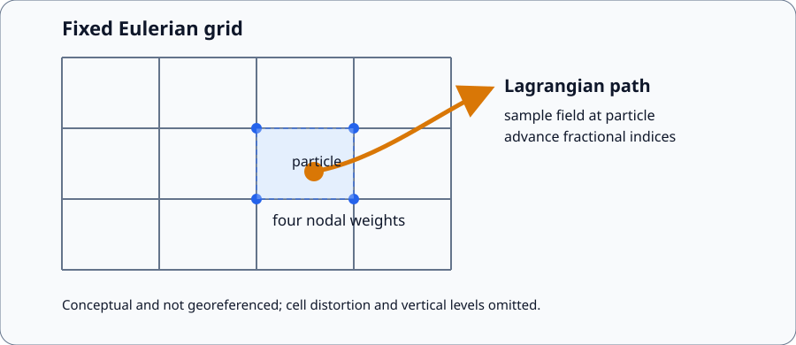
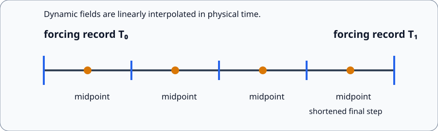
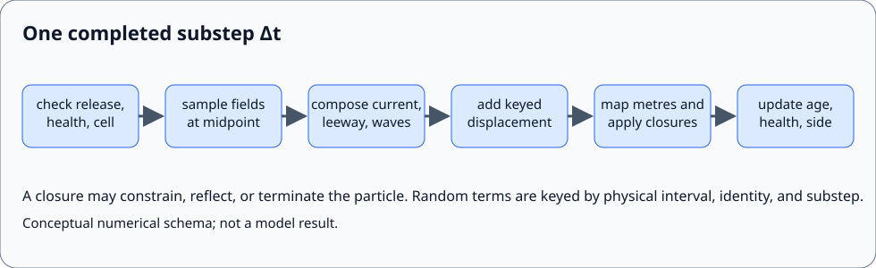

# Physical and numerical model

WaComM++ is an offline Lagrangian transport model. It follows discrete computational particles through velocity and diffusivity fields supplied by Eulerian ocean products; optionally it adds wind-induced leeway and surface Stokes drift. A computational particle is a carrier of position, identity, age, health, release time, and object state. It is not necessarily one molecule, organism, person, or unit mass. Any mapping from particles to a physical inventory belongs to the experiment definition and must be reported with the source and concentration conventions.

This page is the normative overview of the implemented equations. Product normalization is specified in [adapters](adapters.md), surface-object parameterization in [surface drift](sar-drift.md), configuration names in [configuration](configuration.md), temporal inversion in [backtracking](backtracking.md), and continuation in [restart](restart.md).

The figure is a conceptual, non-georeferenced schema. The environmental model supplies values at fixed grid locations; WaComM++ samples those values at a moving fractional grid position and advances that position. It does not solve the Eulerian tracer advection–diffusion equation on a concentration grid.

## Lagrangian formulation

Let the physical position of particle $p$ be $\boldsymbol{x}_p(t)=(x_p,y_p,z_p)$ in metres in a local east–north–vertical basis. The deterministic trajectory is the characteristic of the resolved velocity field,

$$
\frac{\mathrm{d}\boldsymbol{x}_p}{\mathrm{d}t}=\boldsymbol{V}(\boldsymbol{x}_p,t)=\boldsymbol{u}_o+\boldsymbol{u}_\ell+\boldsymbol{u}_s+w_t\boldsymbol{e}_z,
$$

where $\boldsymbol{u}_o=(u_o,v_o,w_o)$ is ocean velocity in m s$^{-1}$, $\boldsymbol{u}_\ell=(u_\ell,v_\ell,0)$ is optional leeway in m s$^{-1}$, $\boldsymbol{u}_s=(u_s,v_s,0)$ is optional surface Stokes velocity in m s$^{-1}$, $w_t$ is configured settling or rise velocity in m s$^{-1}$, and $\boldsymbol{e}_z$ is the model vertical unit vector. Adapters normalize fields; they do not reverse velocities. Leeway and Stokes terms are zero unless explicitly enabled and supplied.

For a smooth resolved field, this ordinary differential equation states that a particle moves with the sampled material velocity. In practice, WaComM++ stores the position as fractional indices $\boldsymbol{q}_p=(k_p,j_p,i_p)$ on the normalized ocean grid. Longitude, latitude, bathymetry, free-surface elevation, and vertical layer fractions define a local map $\mathcal{G}:\boldsymbol{q}\mapsto\boldsymbol{x}$. The solver advances $\boldsymbol{q}$ using local metric distances rather than constructing a global Cartesian coordinate. This distinction matters on distorted or coarse grids: the algorithm is a grid-following approximation to the continuous characteristic, not an exact geodesic integrator.

In stochastic mode the numerical model adds discrete random displacements,

$$
\Delta\boldsymbol{x}_{p,n}=s\,\boldsymbol{V}(\boldsymbol{q}_{p,n},t_{n+1/2})\,\Delta t_n+\boldsymbol{R}_{p,n},\qquad s\in\{-1,+1\},
$$

where $s=+1$ for forward and $s=-1$ for backward tracking, $\Delta t_n>0$ is the physical duration of the substep, and $\boldsymbol{R}_{p,n}$ is a zero-mean keyed random displacement. This is the implemented discrete stochastic model. It must not be silently reinterpreted as a particular continuous stochastic differential equation: the horizontal scale is configured directly as a displacement scale, while the vertical term uses the supplied AKT field through the legacy parameterization described below.

## Particle state and coordinates

The restart-relevant state is

$$
S_p=(n_p,k_p,j_p,i_p,H_p,A_p,T_p,O_p,C_p),
$$

where $n_p$ is a stable unsigned 64-bit identity; $(k_p,j_p,i_p)$ are dimensionless fractional grid coordinates; $H_p$ is dimensionless health; $A_p$ is age in seconds; $T_p$ is emission time in WaComM seconds; $O_p$ is the restart-stable object identifier; and $C_p$ is the resolved crosswind side. The horizontal origin cell is $(\lfloor j\rfloor,\lfloor i\rfloor)$. Thus a negative horizontal coordinate is outside the grid and never aliases cell zero.

Vertical coordinate $k\leq0$ increases upward, with the free surface at $k=0$. For $k_u=\lceil k\rceil$ and $\beta=k_u-k$, $0\leq\beta<1$. A W-level field is sampled between logical levels $k_u$ and $k_u-1$ as

$$F(k)=(1-\beta)F(k_u)+\beta F(k_u-1).$$

Logical level $-N+1,\ldots,0$ maps to contiguous storage index $k+N-1$. Horizontal current components use the containing rho level, whereas vertical velocity and AKT use the two adjacent W levels. A source requested below local bathymetry is placed on the lowest valid particle level.

## Space and time interpolation

At $(j,i)=(j_0+\eta,i_0+\xi)$ with $\xi,\eta\in[0,1)$, any normalized two-dimensional field is bilinearly sampled:

$$
\mathcal{I}_{xy}[F]=(1-\xi)(1-\eta)F_{00}+\xi(1-\eta)F_{01}+(1-\xi)\eta F_{10}+\xi\eta F_{11}.
$$

W-level quantities use the tensor product of these four horizontal weights and the two vertical weights, yielding trilinear interpolation over eight values. The weights sum to one, so constants are preserved. This particle-sampling operator is separate from optional adapter-layer regridding.

For chronological forcing records at $T_0<T_1$, the solver samples every dynamic field at the substep midpoint $t_{n+1/2}$ with

$$
\alpha_n=\frac{t_{n+1/2}-T_0}{T_1-T_0},\qquad F(t_{n+1/2})=(1-\alpha_n)F(T_0)+\alpha_nF(T_1).
$$

The implementation clips $\alpha_n$ to $[0,1]$. Static coordinates and bathymetry are not interpolated in time. The maximum step `physics.dti` is in seconds, and the final step is shortened so that the trajectory lands exactly on the forcing boundary. Midpoint sampling integrates a velocity that is linear in time exactly if its spatial value is constant along the substep; it does not make the complete spatially varying trajectory second-order. Because position is updated once from the velocity sampled at the old spatial position, spatial trajectory integration remains first-order explicit.

The timeline is conceptual. Physical timestamps, not file order or a nominal record period, define each interval. An interior restart begins at its checkpoint and changes only the first clipped substep.

## Metric conversion and position update

The deterministic and random displacements are formed in metres. Local meridional and zonal grid distances $D_y$ and $D_x$ are evaluated with the haversine formula and Earth radius $R_E=6\,371\,000$ m between adjacent coordinate nodes. The vertical cell thickness is

$$D_z=(h+\zeta)\,\Delta s_k,$$

where bathymetry $h$ and free-surface elevation $\zeta$ are in metres and $\Delta s_k$ is the dimensionless normalized layer interval. The candidate fractional coordinate is

$$
j^*=j+\frac{\Delta y}{D_y},\qquad i^*=i+\frac{\Delta x}{D_x},\qquad k^*=k+\frac{\Delta z}{D_z}.
$$

The implementation limits $|\Delta z|$ to one local vertical cell thickness before calculating $k^*$. No corresponding horizontal Courant limiter is applied. Consequently users must select `dti` so horizontal displacements remain small relative to local cells and must demonstrate step-size convergence for the intended forcing resolution. Degenerate or unsuitable grid geometry is not repaired by the Lagrangian solver and should fail during adapter validation where detectable.

## Deterministic velocity composition

For passive particles, $\boldsymbol{u}_\ell=\boldsymbol{u}_s=0$. For a configured surface object,

$$\boldsymbol{V}_h=\boldsymbol{u}_{o,h}+\boldsymbol{u}_\ell+\boldsymbol{u}_s.$$

Leeway is a wind-relative empirical regression with downwind and side-specific crosswind components. Stokes velocity is read as an Earth-relative surface velocity. The complete vector is assembled first and multiplied by $s$ only in the solver. Thus current, wind, waves, and object coefficients retain the same physical sign in forward and backward runs.

Vertical deterministic displacement is $s(w_o+w_t)\Delta t$. The sign of `physics.sv` is therefore defined in the same vertical basis as normalized ocean $w$. Users must verify the selected adapter's declared vertical convention and the intended rise/settling sign with an analytical constant-field case.

## Stochastic displacement

With `physics.random=true`, three independent standard normal variates $Z_{x,p,n}$, $Z_{y,p,n}$, and $Z_{z,p,n}$ are derived from the configured seed, stable identity, absolute physical interval, substep ordinal, and process component. Let $\sigma$ be `physics.sigma` in metres, $k_b<0$ the lowest logical particle level, $K_v$ the interpolated AKT value in m$^2$ s$^{-1}$, $c_r$ the configured reduction coefficient, and $\Delta t_0=\mathrm{dti}$. The implementation is

$$\sigma_k=\sigma\left(1-\frac{k}{k_b}\right),$$

$$
R_x=\sigma_k Z_x\sqrt{\frac{\Delta t}{\Delta t_0}},\quad R_y=\sigma_k Z_y\sqrt{\frac{\Delta t}{\Delta t_0}},\quad R_z=\sigma_k K_v c_r Z_z\sqrt{\frac{\Delta t}{\Delta t_0}}.
$$

The square-root factor preserves increment variance under a shortened final step. The horizontal variance per complete configured step is $\sigma_k^2$ m$^2$. This corresponds diagnostically to an effective one-component diffusivity $K_{h,\mathrm{eff}}=\sigma_k^2/(2\Delta t_0)$ only under independent increments and away from closures. It is not a claim that `sigma` is a universal turbulent diffusivity.

The legacy vertical expression multiplies a metre displacement scale by AKT and `crid`; its dimensional closure therefore depends on the configured interpretation of `crid`. It is not the standard random-displacement form $\sqrt{2K_v\Delta t}\,Z$ and should not be described as such. Scientific use must report `sigma`, `crid`, `dti`, the AKT units and provenance, and a sensitivity analysis. A future change to this operator is a physical-model change requiring migration documentation and backend-equivalence tests.

Random values are schedule-independent, but mathematical repeatability is not the same as statistical validation. Particle ensembles approximate the distribution induced by the selected discrete model, initial ensemble, forcing, and parameter hypotheses. They are not automatically probabilities of location, confidence regions, or posterior source estimates.

## Boundary operators

Three closure locations are configured independently: upper vertical boundary, lower vertical boundary, and horizontal/shore boundary. Each supports:

- `constraint`: retain or clamp the affected coordinate;
- `kill`: set health negative and stop advancing the particle;
- `reflection`: mirror the candidate coordinate into the admissible domain.

A candidate coast cell is classified by bilinearly sampled wet depth $h+\zeta\leq h_{shore}$, where `shore_limit` is in metres. Reflection is a numerical boundary operator, not a wave run-up, beaching, refloating, resuspension, or shoreline-intersection model. Constraint is likewise not evidence that a real object remains stationary at the coast. Boundary encounters destroy ordinary time reversibility because the mapping can discard or fold trajectory information.

The diagram is a conceptual software-and-numerics schema. It identifies where environmental sampling, physical composition, stochastic displacement, closure, and state updates occur; it is not a trajectory result.

## Age, health, sources, and concentration

An emitted particle becomes active when forward physical time reaches its stored release time. Backward mode suppresses ordinary forward source emission. After every completed live substep, age advances by $\Delta t$ and health is reset to

$$H(A)=H_0\exp\left(-\frac{A}{\tau_0}\right),$$

where $H_0$ is the model initial health, $A$ is age in seconds, and `physics.tau0` is the e-folding time in seconds. A particle is killed before motion when $H<p_{surv}$, where `physics.survprob` is the configured dimensionless threshold. This is deterministic exponential decay followed by threshold removal; it is not a Bernoulli survival draw. Its suitability depends on the transported quantity and must be justified independently.

Concentration output bins computational particles after integration. Counts depend on source weighting, active-state selection, closures, and output convention; numerical count preservation is verification evidence, not mass-conservation evidence for an unrepresented chemical or biological process.

## Forward, backward, and restart semantics

Deterministic backward tracking evaluates the same normalized physical velocity field and applies $s=-1$ to the complete displacement. With diffusion, decay, source emission, jibing, and boundary interactions disabled, a sufficiently small-step constant or smooth-field forward/backward experiment is a reversibility test. It is not generally exact for a spatially varying field because explicit numerical integration is not self-adjoint.

`tracking.backward_diffusion=symmetric_stochastic` samples dispersive candidate origins. It does not reconstruct the noise history of a forward particle and is not a unique inverse. Exact stochastic restart equivalence is claimed only at completed substep boundaries with unchanged forcing bracket, `dti`, seed, identities, direction, configuration, and resolved object state. See [backtracking](backtracking.md) and [restart](restart.md).

## Verification, validation, and known limits

Verification asks whether code solves the stated discrete equations; validation asks whether those equations adequately represent observations for a declared application. WaComM++ regression tests cover interpolation identities, interval clipping, constant and time-linear forcing, closures, seeded reproducibility, restart continuation, and backend parity. They do not validate forcing quality, turbulence closure, leeway coefficients outside their experimental scope, shoreline physics, or source inference.

Every scientific study should, at minimum, report:

1. forcing product, variables, units, grid, time resolution, and checksums;
2. source or terminal ensemble and the physical meaning of a particle;
3. `dti` convergence and sensitivity to forcing resolution;
4. closure, decay, settling/rise, diffusion, leeway, wave, and uncertainty settings;
5. forward/backward and restart interpretation;
6. deterministic and stochastic ensemble convergence criteria;
7. comparison with independent observations where a validation claim is made;
8. the complete reproducibility record defined in [reproducibility](reproducibility.md).

Principal limitations are offline one-way coupling, interpolation error inherited from finite forcing resolution, fractional-index metric approximation, no automatic subgrid coastline geometry, no standard continuous-SDE claim for the legacy random displacement, and conditional—not unique—inference from backward ensembles.

The private Unix build (other than macOS) uses pinned OpenSSL 3.5.8 for HTTPS forcing transport, as documented in the [build guide](build.md). This dependency belongs to data access and does not change the governing equations, physical time, tracking direction, or restart state.

The [six-hour Sarno diagnostic](../examples/wacomm-sarno-lite.md) illustrates the existing model without changing its equations. The missing 12:00 record is interpolated across 11:00–13:00; source emission occurs at available interval starts, yielding five batches. Profile depth is the exported bathymetry/sigma coordinate, with no instantaneous sea-level term. The [diagnostic estimators](trajectory-diagnostics.md#publication-maps-and-profiles) distinguish counts, radial distances, and member quantiles from mass or calibrated probability.

The documented two-process MPI Sarno execution reproduces every stored serial particle variable exactly at the five saved times. This verifies backend agreement for this case without changing the governing model or providing observational validation.

The [MPI/OpenMP Sarno scaling experiment](../examples/wacomm-sarno-lite.md#mpiopenmp-strong-scaling) changes execution resources only, preserving the six-hour forcing, source schedule, seed, and boundary configuration. Solver timing uses MPI barriers around monotonic clock measurements to exclude forcing work; separate application timing includes native I/O. These synchronization and diagnostic operations leave physical time, particle state, and random coordinates unchanged. Timing ratios characterize the measured execution scope; they neither change the physical model nor constitute observational validation.

### Native boundary replay

For an existing forcing window $W$, let $t_e$ be the solver-selected endpoint time and $t_b$ the adjacent record time, both in seconds since the declared epoch. Let $F=(\zeta,u,v,w,K_z)$ denote elevation (m), Earth-relative horizontal/vertical velocities (m s$^{-1}$), and vertical diffusivity (m$^2$ s$^{-1}$) at every stored grid location. A saved native boundary already present in $W$ is reused according to

$$
W \oplus (t_b,F_b)=W \quad\text{if}\quad t_b=t_e\ \text{and}\ F_b=F_e.
$$

Equality of the endpoint time and dynamic fields is exact numeric equality after the existing geometry checks. A conflicting equal-time record is rejected. This identity operation preserves the original interpolation interval, source emission schedule, and stochastic coordinates; it introduces no zero-duration interval or additional release. It applies to either endpoint chosen by the solver, preserving forward/backward and restarted forcing support. The [native adapter regression](testing.md) exercises both endpoint choices with restart equivalence. This is a correction to replay of already-normalized data, not a new physical parameterization.

The [OpenMP/MPI comparison](../examples/wacomm-sarno-lite.md#openmp-strong-scaling-and-mpi-comparison) holds the governing model and forcing fixed. Different thread/process decompositions are verified through exact stored-particle comparisons; measured speedup and efficiency concern computation, not physical accuracy or observational validation.

## References

- Dimou, K. N., and Adams, E. E. (1993). A random-walk, particle tracking model for well-mixed estuaries and coastal waters. *Estuarine, Coastal and Shelf Science*, 37, 99–110. [doi:10.1006/ecss.1993.1044](https://doi.org/10.1006/ecss.1993.1044).
- Visser, A. W. (1997). Using random walk models to simulate the vertical distribution of particles in a turbulent water column. *Marine Ecology Progress Series*, 158, 275–281. [doi:10.3354/meps158275](https://doi.org/10.3354/meps158275).
- Thygesen, U. H. (2011). How to reverse time in stochastic particle tracking models. *Journal of Marine Systems*, 88, 159–168. [doi:10.1016/j.jmarsys.2011.03.009](https://doi.org/10.1016/j.jmarsys.2011.03.009).
- Dagestad, K.-F., Röhrs, J., Breivik, Ø., and Ådlandsvik, B. (2018). OpenDrift v1.0: a generic framework for trajectory modelling. *Geoscientific Model Development*, 11, 1405–1420. [doi:10.5194/gmd-11-1405-2018](https://doi.org/10.5194/gmd-11-1405-2018).
- Breivik, Ø., Allen, A. A., Maisondieu, C., and Roth, J.-C. (2011). Wind-induced drift of objects at sea: the leeway field method. *Applied Ocean Research*, 33, 100–109. [doi:10.1016/j.apor.2011.01.005](https://doi.org/10.1016/j.apor.2011.01.005).
- Montella, R., et al. (2023). A highly scalable high-performance Lagrangian transport and diffusion model for marine pollutants assessment. *Proceedings of PDP 2023*, 17–26. [doi:10.1109/PDP59025.2023.00012](https://doi.org/10.1109/PDP59025.2023.00012).
