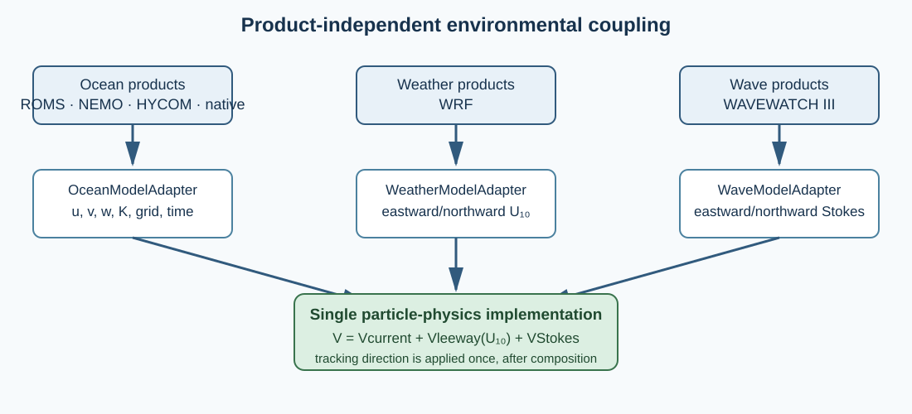

# OpenDrift comparison and WaComM++ development roadmap

## Scope and method

This comparison treats OpenDrift as an independently developed reference framework, not as a conformance target. Capabilities were checked against the OpenDrift documentation available on 9 September 2026 and against Dagestad et al. (2018). The comparison separates documented capability from numerical or observational validation. WaComM++ claims are restricted to code paths and tests in this repository.

## Capability comparison

| Scientific-software concern | OpenDrift | WaComM++ | Consequence and priority |
|---|---|---|---|
| Environmental abstraction | A common reader hierarchy covers continuous, structured, and unstructured data; model variables are mediated through CF-oriented names. | Separate ocean, weather, and wave adapter interfaces normalize supported products onto one particle grid. | Preserve typed separation and require each regridding operator to declare whether its sampled quantity, conservation law, and vector basis make conservation meaningful. |
| Products and transport | Readers include local and remote sources, including generic CF NetCDF and OPeNDAP workflows. | ROMS, NEMO, HYCOM, native WaComM, WRF, and WW3 local NetCDF products are explicit. | Remote and lazy access remain a gap; silent fallback is intentionally prohibited. |
| Physics catalog | Specialized models cover passive ocean drift, leeway, oil, eggs, plastics, icebergs, ships, and other applications. | One transport core covers passive particles and an initial surface-object leeway catalog with optional explicit Stokes drift. | Add new physics only with equations, units, references, restart analysis, and backend-equivalence tests. Breadth alone is not a quality metric. |
| Search-and-rescue uncertainty | Leeway supports ensemble properties and converts hourly jibing probability through an exponential hazard; plotting exposes trajectory spread. | Deterministic or randomized initial side, catalog-residual ensembles, seeded diffusion, and explicit hourly-probability jibing use reproducible counter keys; backward stochastic output is a family of candidate origins. | Validate object-specific probabilities and covariance against observations before probabilistic operational interpretation. |
| Stokes drift | Model-dependent and configurable; OpenDrift documents that Stokes motion may be implicit in classical leeway coefficients. | WW3 surface Stokes drift is an explicit optional vector addition, with the same double-counting warning. | Require each study to state whether coefficients were calibrated for explicit waves. |
| Grid/projection mediation | Readers support multiple projections and interpolate at element locations. | Environmental adapters provide explicit geographic/projected interpolation; separate first- and limited second-order operators conserve scalar cell integrals across rectilinear or convex-curvilinear geographic grids with fractional active area. | Retain fail-fast behavior for unsupported geometry and undefined vector fluxes. |
| Execution architecture | Vectorized Python framework with lazy environmental access. | C++17 implementation with MPI/FlexMPI decomposition, OpenMP particle parallelism, and accelerator paths where supported. | WaComM++ should retain backend equivalence and scaling as its distinguishing engineering objective. |
| Restart and reproducibility | NetCDF trajectory output can be imported for continuation and carries CF-style metadata. | Forward and backward restart equivalence, stable stochastic keys, configuration snapshots, input/output checksums, and explicit tolerances are tested contracts. | Preserve physical-time restart invariants as new environmental providers and physics are introduced. |
| Visualization and interaction | Plotting, animation, GUI, notebook examples, and an extensive gallery are first-class interfaces. | NetCDF outputs and documented command-line examples are primary; a tested postprocessor produces provenance-bearing JSON ensemble summaries and accessible SVG trajectory maps. | Extend only with explicit statistical meaning and geospatial provenance; presentation breadth is not evidence of model skill. |

The OpenDrift reader hierarchy and remote-data goals are described in its [reader documentation](https://opendrift.github.io/autoapi/opendrift/readers/index.html) and [framework specification](https://opendrift.github.io/theory/specification.html). Its [model-selection table](https://opendrift.github.io/choosing_a_model.html) distinguishes direct wind, Stokes drift, and vertical processes, while the [tutorial](https://opendrift.github.io/tutorial.html) documents CF-oriented required variables and fallback behavior. The [gallery](https://opendrift.github.io/gallery/index.html) provides the basis for the visualization comparison.

## Implemented interoperability improvement

The WW3 adapter now recognizes both product aliases and the CF-oriented names used by OpenDrift-compatible wave products:

```text
eastward_surface_stokes_drift
northward_surface_stokes_drift
sea_surface_wave_stokes_drift_x_velocity
sea_surface_wave_stokes_drift_y_velocity
```

The adapter still requires explicit coordinates, a strictly chronological time axis, compatible dimensions, velocity in m s-1, and exact compatibility with the normalized ocean grid. It does not infer missing physics, download remote data, or regrid silently.

## Mathematical invariant

For a surface object at horizontal position **x** and physical time `t`, WaComM++ advances

$$
\frac{d\mathbf{x}}{dt}=\mathbf{V}_{c}(\mathbf{x},t)+\mathbf{V}_{L}(\mathbf{U}_{10}(\mathbf{x},t);q,s)+\chi_S\mathbf{V}_{S}(\mathbf{x},t),
$$

where `q` is the object class, `s` is the crosswind side, and `χS` is one only when a wave adapter is configured. Product adapters determine the representation of `Vc`, `U10`, and `VS`; they do not change this equation. Backward tracking changes the sign of the integration increment, not any environmental vector.



## Roadmap governed by evidence

The comparison identifies four ordered research-engineering milestones. Status refers to the repository revision containing this document:

1. **Implemented:** extend CF metadata and unit validation across WRF and WW3 environmental adapters, rejecting ambiguous units and normalizing supported CF time coordinates.
2. **Implemented:** provide explicit rectilinear and inverse-bilinear curvilinear geographic interpolation, optional declared-CRS projection for metric WRF/WW3 grids, and separate first- and limited second-order conservative remapping for rectilinear or convex-curvilinear geographic cell-average scalars with explicit active fractions. Point-sampled environmental velocity remains bilinear because scalar conservation does not define a vector-flux operator; undefined vector conservation and unsupported geometry fail rather than being inferred.
3. **Partially implemented:** add reproducible SAR parameter ensembles from cataloged regression residual standard deviations, a user-declared Bernoulli prior over initial side, and user-declared hourly-probability jibing converted through a constant exponential hazard with one resolved transition at most per substep. Random coordinates include stable identity, physical interval, and substep where appropriate. Empirical covariance, forcing uncertainty, observational calibration, and object-specific transition catalogs remain open.
4. **Implemented:** add a read-only trajectory-map and ensemble-diagnostic tool that joins stable identities across physical-time snapshots, handles the antimeridian, reports geodesic radial-spread summaries, propagates input checksums/build provenance, and emits a self-describing accessible SVG without inventing coastline data or probability contours.

Each milestone must preserve deterministic forward/backward behavior, restart equivalence, seed independence from parallel scheduling, and serial/OpenMP/MPI/accelerator equation parity.

## References

- Dagestad, K.-F., Röhrs, J., Breivik, Ø., and Ådlandsvik, B. (2018). OpenDrift v1.0: a generic framework for trajectory modelling. *Geoscientific Model Development*, 11, 1405–1420. [doi:10.5194/gmd-11-1405-2018](https://doi.org/10.5194/gmd-11-1405-2018).
- Montella, R., Di Luccio, D., De Vita, C. G., Mellone, G., Lapegna, M., Ortega, G., Marcellino, L., Zambianchi, E., and Giunta, G. (2023). A highly scalable high-performance Lagrangian transport and diffusion model for marine pollutants assessment. *31st Euromicro International Conference on Parallel, Distributed and Network-Based Processing*, 17–26. [doi:10.1109/PDP59025.2023.00012](https://doi.org/10.1109/PDP59025.2023.00012).
- Breivik, Ø., Allen, A. A., Maisondieu, C., and Roth, J.-C. (2011). Wind-induced drift of objects at sea: the leeway field method. *Applied Ocean Research*, 33, 100–109. [doi:10.1016/j.apor.2011.01.005](https://doi.org/10.1016/j.apor.2011.01.005).
- Hassell, D., Gregory, J., Blower, J., Lawrence, B. N., and Taylor, K. E. (2017). A data model of the Climate and Forecast metadata conventions (CF-1.6) with a software implementation (cf-python v2.1). *Geoscientific Model Development*, 10, 4619–4646. [doi:10.5194/gmd-10-4619-2017](https://doi.org/10.5194/gmd-10-4619-2017).
