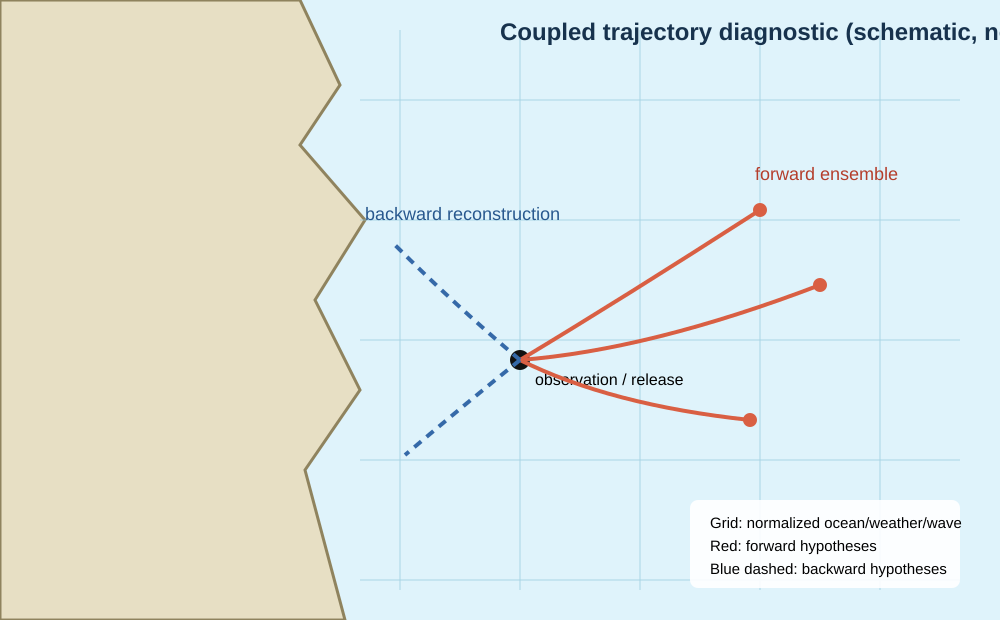

# Surface drift objects

WaComM++ represents floating search-and-rescue objects as Lagrangian tracers whose motion is conditioned on resolved surface current and an empirically derived wind-relative velocity. This formulation treats object class as physical metadata attached to a compact particle rather than as a separate solver. The first implementation supports `PERSON_IN_WATER`, `LIFERAFT_NO_DROGUE`, `LIFERAFT_DROGUE`, `GENERIC_VESSEL`, and `SHIPPING_CONTAINER`. Passive transport remains the default and does not evaluate wind or the object catalog.

## Physical model and units

The horizontal object velocity in m s-1 is

```text
V_object = V_current + V_leeway + V_stokes
V_leeway = (a_DW |W10| + b_DW) w_hat
           + side (a_CW |W10| + b_CW) w_hat_perp
```

`W10` is the 10 m wind vector in m s-1, `w_hat_perp=(-w_hat_y,w_hat_x)`, slopes are dimensionless, offsets are m s-1, and `side` is -1 for left or +1 for right. Wind below 1e-12 m s-1 produces zero leeway and is never normalized. Catalog values are converted from percent and cm s-1 to SI units. The generic vessel uses the fishing-vessel mean class; the container uses the experimentally characterized 20-ft, 80%-submerged class. The parameterization follows the peer-reviewed leeway field methodology of Breivik et al. (2011), the container experiments of Breivik et al. (2012), and the operational Lagrangian context described by Dagestad et al. (2018).

The coefficients are empirical regression parameters, not universal material constants. Their validity is conditional on object configuration, immersion, loading, environmental range, current reference depth, and observational uncertainty. A catalog choice therefore constitutes a scientific hypothesis that must be recorded with the forcing and numerical configuration.

Classical leeway observations can contain wave-correlated motion implicitly because leeway is defined relative to a near-surface current. Adding an explicit WW3 Stokes vector may therefore double count part of the wave contribution unless coefficients and current reference are calibrated for an explicit-wave formulation. Runs enabling WW3 must state this modeling choice and validate it against an appropriate observational dataset; the implementation performs the requested vector sum but does not assert universal validity of that decomposition.



The map is deliberately schematic and is not a simulation result or a geographic basemap. Its purpose is to distinguish the direction of inference, the common forcing grid, and an ensemble footprint; scientific maps must instead be generated from archived trajectory output with an identified projection, coastline source, spatial extent, timestamp, and uncertainty definition.

The constant-wind provider is intended for controlled experiments and forcing-window studies. Configure `environment.wind.adapter` as `constant` and provide eastward `u10` and northward `v10`. For resolved coupling, `WRFAdapter` supplies rotated Earth-relative 10 m wind and `WW3Adapter` supplies surface Stokes components. Both are bilinearly interpolated in the particle cell and linearly interpolated at the physical substep midpoint. Their grids and timestamps must already match the normalized ocean forcing; regridding is outside the first coupling milestone.

## Direction and restart semantics

The drift calculation is direction-neutral. The existing solver multiplies the combined deterministic current and leeway velocity by `trackingDirection`; adapters and the leeway model never reverse velocity. A deterministic forward run followed by the same backward forcing retraces the modeled displacement within numerical tolerance. Stochastic backward ensembles remain distributions of plausible prior locations, not exact inverse trajectories.

NetCDF restart version 3 stores stable numeric object type and crosswind side for every particle. Version 2 restarts remain readable in passive mode and are rejected for leeway runs because they lack required object state. Text restarts append the same two fields while retaining compatibility with earlier seven-field records.

## Configuration and limitations

Select `drift.model=leeway`, a supported `object_type`, and `side=left|right`. Missing wind, unknown objects, or undefined side fail during configuration. Coefficient uncertainty, randomized side, jibing, vertical Stokes profiles, environmental regridding, and refloating are not yet implemented. Existing coastline closure behavior applies unchanged.

Record the configured wind, random seed, forcing and restart checksums, Git revision, compiler, CMake options, backend settings, tolerances, and output checksums. Deterministic math is shared by serial, OpenMP, and MPI execution. CUDA/OpenACC builds use the same particle representation; operational leeway parity on those backends must be validated before use.

## References

- Breivik, Ø., Allen, A. A., Maisondieu, C., and Roth, J.-C. (2011). Wind-induced drift of objects at sea: the leeway field method. *Applied Ocean Research*, 33, 100–109. [doi:10.1016/j.apor.2011.01.005](https://doi.org/10.1016/j.apor.2011.01.005).
- Breivik, Ø., Allen, A. A., Maisondieu, C., Roth, J.-C., and Forest, B. (2012). The leeway of shipping containers at different immersion levels. *Ocean Dynamics*, 62, 741–752. [doi:10.1007/s10236-012-0522-z](https://doi.org/10.1007/s10236-012-0522-z).
- Dagestad, K.-F., Röhrs, J., Breivik, Ø., and Ådlandsvik, B. (2018). OpenDrift v1.0: a generic framework for trajectory modelling. *Geoscientific Model Development*, 11, 1405–1420. [doi:10.5194/gmd-11-1405-2018](https://doi.org/10.5194/gmd-11-1405-2018).
- Thygesen, U. H. (2011). How to reverse time in stochastic particle tracking models. *Journal of Marine Systems*, 88, 159–168. [doi:10.1016/j.jmarsys.2011.03.009](https://doi.org/10.1016/j.jmarsys.2011.03.009).
