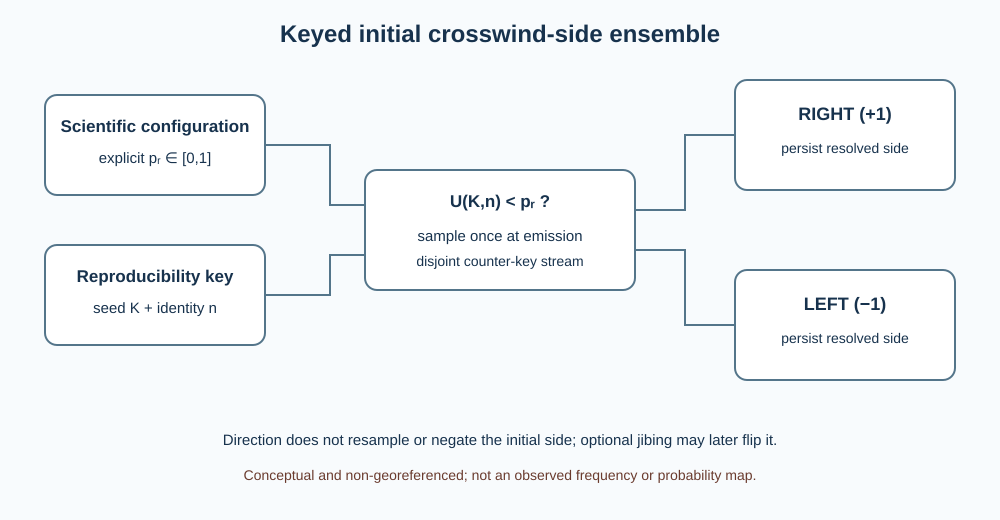
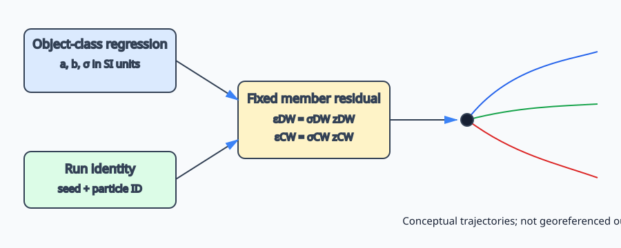

# Surface drift objects

WaComM++ represents floating search-and-rescue objects as Lagrangian tracers whose motion is conditioned on resolved surface current and an empirically derived wind-relative velocity. This formulation treats object class as physical metadata attached to a compact particle rather than as a separate solver. The first implementation supports `PERSON_IN_WATER`, `LIFERAFT_NO_DROGUE`, `LIFERAFT_DROGUE`, `GENERIC_VESSEL`, and `SHIPPING_CONTAINER`. Passive transport remains the default and does not evaluate wind or the object catalog.

## Physical model and units

The horizontal object velocity in m s-1 is

```text
V_object = V_current + V_leeway + V_stokes
V_leeway = (a_DW |W10| + b_DW + sigma_DW z_DW) w_hat
           + side (a_CW |W10| + b_CW + sigma_CW z_CW) w_hat_perp
```

`W10` is the 10 m wind vector in m s-1, `w_hat_perp=(-w_hat_y,w_hat_x)`, slopes `a` are dimensionless, offsets `b` and residual standard deviations `sigma` are m s-1, and `side` is -1 for left or +1 for right. In catalog-mean mode, `z_DW=z_CW=0`. With `drift.coefficient_ensemble=true`, let `x1,x2` be independent standard normals fixed by seed and identity; then `z_DW=x1` and `z_CW=rho*x1+sqrt(1-rho^2)*x2`, where the declared dimensionless `rho` lies in [-1,1]. Wind below 1e-12 m s-1 produces zero leeway and is never normalized. Catalog values are converted from percent and cm s-1 to SI units. The generic vessel uses the fishing-vessel mean class; the container uses the experimentally characterized 20-ft, 80%-submerged class. The parameterization follows the peer-reviewed leeway field methodology of Breivik et al. (2011), the container experiments of Breivik et al. (2012), and the operational Lagrangian context described by Dagestad et al. (2018).

The coefficients are empirical regression parameters, not universal material constants. Their validity is conditional on object configuration, immersion, loading, environmental range, current reference depth, and observational uncertainty. A catalog choice therefore constitutes a scientific hypothesis that must be recorded with the forcing and numerical configuration.

The coefficient ensemble represents residual variability around the fitted leeway regressions. It does not propagate regression-coefficient, object-classification, or structural-model uncertainty. Gaussian support is unbounded, so an individual residual may reverse a modeled component; no undocumented clipping is imposed. The default `rho=0` is an independence assumption; any nonzero value is a study-supplied covariance hypothesis and is not implied by the catalog.

Optional wind uncertainty replaces the sampled wind at each substep by

$$
\widetilde{\mathbf W}_{10,n,m}=\mathbf W_{10}+\sigma_W(Z_{u,n,m},Z_{v,n,m}),
$$

where `sigma_W` is the configured component standard deviation in m s-1 and both `Z` values are independent standard normals keyed by particle identity `n`, physical forcing interval, and absolute substep `m`. This is the temporally uncorrelated wind perturbation class described by Coppini et al. (2016), made explicit at the WaComM++ integration-step scale. It is isotropic in the Earth-relative east/north basis, has zero ensemble mean, and has no modeled spatial covariance between particles. It is not an ensemble weather forecast, and `dti` controls its temporal discretization.

Crosswind-side uncertainty is a separate initial-condition model. With `side=random` and required $p_R=\mathtt{side\_right\_probability}$,

$$
S_n=\begin{cases}+1,&U(K,n)<p_R,\\-1,&U(K,n)\ge p_R,\end{cases}
$$

where $S_n$ is the resolved dimensionless side for stable particle identity $n$, $K$ is the configured integer seed, and $U\in[0,1)$ is the counter-key uniform variate. The user-declared $p_R$ is a prior experiment parameter, not an empirical catalog statistic. Assignment occurs once at emission and the resolved side persists unless the separately configured jibing process changes it.

For an explicitly supplied hourly transition probability $p_h=\mathtt{jibe\_probability\_per\_hour}$, WaComM++ uses a constant exponential waiting-time hazard with at most one resolved transition per integration substep:

$$
\lambda=-\frac{\ln(1-p_h)}{3600\ \mathrm{s}},\qquad
p_{\Delta t}=1-\exp(-\lambda|\Delta t|),\qquad
S\leftarrow-S\ \text{if}\ U(K,n,I,m)<p_{\Delta t},
$$

where $\lambda$ is the transition hazard in s-1, $\Delta t$ is the completed physical substep in s, $I$ is the forcing interval keyed by its lower physical time, and $m$ is its absolute substep index. The limiting cases $p_h=0$ and 1 mean no transition and one transition after every positive-duration substep. The displacement over a substep uses its incoming side; a successful draw changes subsequent motion. Multiple unresolved flips inside one substep are not represented, so `dti` is part of the scientific configuration. Absolute step duration gives the same transition probability in either tracking direction, but a backward realization is not the pathwise inverse of a forward realization.



The schema is conceptual and non-georeferenced. It illustrates reproducible initial side assignment, not observed side frequencies or a trajectory probability map. When jibing is enabled, the stored side may subsequently change at completed physical substeps.



This schema is conceptual, not a georeferenced model result. Each path is one reproducible parameter member; path spread must not be interpreted as a calibrated probability region without an external validation study.

Classical leeway observations can contain wave-correlated motion implicitly because leeway is defined relative to a near-surface current. Adding an explicit WW3 Stokes vector may therefore double count part of the wave contribution unless coefficients and current reference are calibrated for an explicit-wave formulation. Runs enabling WW3 must state this modeling choice and validate it against an appropriate observational dataset; the implementation performs the requested vector sum but does not assert universal validity of that decomposition.


The map is deliberately schematic and is not a simulation result or a geographic basemap. Its purpose is to distinguish the direction of inference, the common forcing grid, and an ensemble footprint; scientific maps must instead be generated from archived trajectory output with an identified projection, coastline source, spatial extent, timestamp, and uncertainty definition.

The constant-wind provider is intended for controlled experiments and forcing-window studies. Configure `environment.wind.adapter` as `constant` and provide eastward `u10` and northward `v10`. For resolved coupling, `WRFAdapter` supplies rotated Earth-relative 10 m wind and `WW3Adapter` supplies surface Stokes components. Both are bilinearly interpolated in the particle cell and linearly interpolated at the physical substep midpoint. Their grids and timestamps must already match the normalized ocean forcing; regridding is outside the first coupling milestone.

## Direction and restart semantics

The drift calculation is direction-neutral. The existing solver multiplies the combined deterministic current and leeway velocity by `trackingDirection`; adapters and the leeway model never reverse velocity. A deterministic forward run followed by the same backward forcing retraces the modeled displacement within numerical tolerance. Stochastic backward ensembles remain distributions of plausible prior locations, not exact inverse trajectories.

NetCDF restart version 3 stores stable numeric object type and crosswind side for every particle. Version 2 restarts remain readable in passive mode and are rejected for leeway runs because they lack required object state. Text restarts append the same two fields while retaining compatibility with earlier seven-field records.

Ensemble residuals and initial side assignment are stateless functions of the configured seed and stored 64-bit particle identity. Wind-error and jibing draws additionally use the forcing interval and absolute substep. They are invariant under MPI/OpenMP/CUDA scheduling, and continuation at a completed substep boundary reproduces an uninterrupted run. Changing `dti` changes the wind-error sequence and discrete event realization. With wind error or jibing, backward output must be interpreted as a stochastic candidate-origin ensemble rather than a pathwise inverse.

## Configuration and limitations

Select `drift.model=leeway`, a supported `object_type`, and `side=left|right|random`; optionally set `coefficient_ensemble=true`, `residual_correlation`, `environment.wind.uncertainty_stddev`, and an explicit `jibe_probability_per_hour`. Random side additionally requires an explicit probability in [0,1]. Missing wind, unknown objects, undefined side, invalid uncertainty, or uncertainty requested for passive transport fails during configuration. WaComM++ deliberately does not install a universal covariance, wind-error magnitude, or object-specific jibing rate: those quantities require observational estimation for the selected object and forcing system. Vertical Stokes profiles, conservative vector-flux remapping, and refloating remain unavailable.

Record the configured wind, random seed, forcing and restart checksums, Git revision, compiler, CMake options, backend settings, tolerances, and output checksums. Deterministic math is shared by serial, OpenMP, and MPI execution. CUDA/OpenACC builds use the same particle representation; operational leeway parity on those backends must be validated before use.

## References

- Breivik, Ø., Allen, A. A., Maisondieu, C., and Roth, J.-C. (2011). Wind-induced drift of objects at sea: the leeway field method. *Applied Ocean Research*, 33, 100–109. [doi:10.1016/j.apor.2011.01.005](https://doi.org/10.1016/j.apor.2011.01.005).
- Breivik, Ø., and Allen, A. A. (2008). An operational search and rescue model for the Norwegian Sea and the North Sea. *Journal of Marine Systems*, 69, 99–113. [doi:10.1016/j.jmarsys.2007.02.010](https://doi.org/10.1016/j.jmarsys.2007.02.010).
- Breivik, Ø., Allen, A. A., Maisondieu, C., Roth, J.-C., and Forest, B. (2012). The leeway of shipping containers at different immersion levels. *Ocean Dynamics*, 62, 741–752. [doi:10.1007/s10236-012-0522-z](https://doi.org/10.1007/s10236-012-0522-z).
- Dagestad, K.-F., Röhrs, J., Breivik, Ø., and Ådlandsvik, B. (2018). OpenDrift v1.0: a generic framework for trajectory modelling. *Geoscientific Model Development*, 11, 1405–1420. [doi:10.5194/gmd-11-1405-2018](https://doi.org/10.5194/gmd-11-1405-2018).
- Thygesen, U. H. (2011). How to reverse time in stochastic particle tracking models. *Journal of Marine Systems*, 88, 159–168. [doi:10.1016/j.jmarsys.2011.03.009](https://doi.org/10.1016/j.jmarsys.2011.03.009).
- Coppini, G., Jansen, E., Turrisi, G., Creti, S., Shchekinova, E. Y., Pinardi, N., Lecci, R., Carluccio, I., Kumkar, Y. V., D'Anca, A., Mannarini, G., Martinelli, S., Marra, P., Capodiferro, T., and Gismondi, T. (2016). A new search-and-rescue service in the Mediterranean Sea: a demonstration of the operational capability and an evaluation of its performance using real case scenarios. *Natural Hazards and Earth System Sciences*, 16, 2713–2727. [doi:10.5194/nhess-16-2713-2016](https://doi.org/10.5194/nhess-16-2713-2016).
