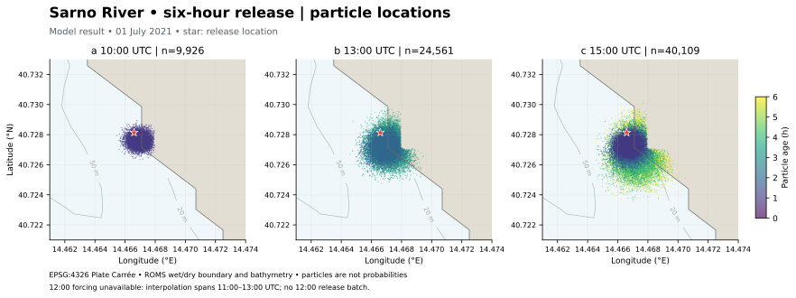
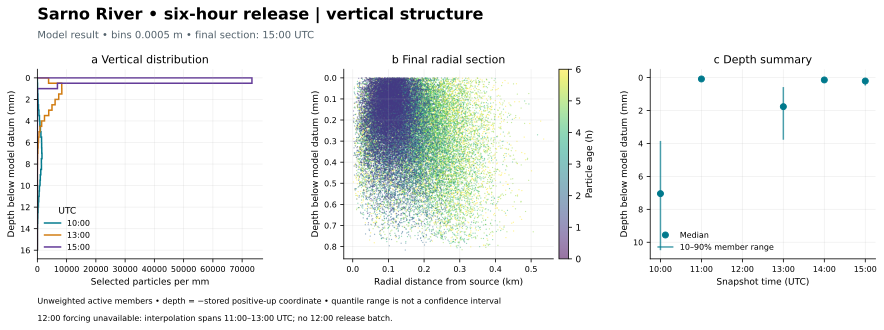

# Sarno River: six-hour coastal release

## Scientific objective

Follow a passive stochastic release near the Sarno River mouth from **2021-07-01 09:00 to 15:00 UTC**. The diagnostic question is how selected particles spread horizontally and occupy the model's near-surface vertical coordinate over six hours. This is a conditional model result, not pollutant-mass exposure, an observational validation, or a search-area probability. No leeway object model is selected.

## Prerequisites and required fields

Use the serial C++17 application (or the MPI build described below) with NetCDF C++4, built as described in the [build guide](../docs/build.md). The provided Slurm wrapper requires the host's four environment modules, `high-wn`, curl, and `ncdump`. It requests one node, one CPU, 32 GiB RAM, and one hour. Data and all run outputs live under **`data/wacomm-sarno-lite/`**, which is ignored by Git; archive it separately. Reserve at least 40 GiB for ROMS files, normalized native forcing, snapshots, and gridded output.

Download the six files with hours **09, 10, 11, 13, 14, 15** from the [provider archive](https://data.meteo.uniparthenope.it/files/rms3/d03/history/2021/07/01/), using names `rms3_d03_20210701ZHH00.nc`. Each file is 2,816,026,296 bytes in the recorded run. The provider's 12:00 record is absent. The existing solver interpolates forcing between 11:00 and 13:00; no file or observational value is fabricated to fill this gap.

ROMS fields include wet/dry masks, longitude/latitude in degrees east/north, `h` and `zeta` in metres, `s_rho`/`s_w` dimensionless vertical coordinates, staggered `u`/`v` and `w` in m s⁻¹, `AKt` in m² s⁻¹, and chronological `ocean_time` in seconds since 1968-05-23 00:00:00. The supplied grid is 1,135 × 1,528 with 30 rho levels. The source GeoJSON is `sources-sarno_river.json`, at 14.466590881347654°E, 40.72813686316017°N. See [ROMS normalization](../docs/adapters.md) and [model limitations](../docs/model.md).

## Configuration and exact commands

`wacomm-sarno-lite.json` selects `dry=false`, the ROMS adapter, seed 5489, random particle transport, deterministic source positions, forward tracking, upper reflection, lower constraint, and horizontal kill. `io.save_input=true` saves normalized native forcing to `processed-6h/`; `io.save_history="nc"` saves particle snapshots to `snapshots-6h/`; `output-6h/` receives gridded particle counts. Restart loading is disabled. Source, closure, decay, and diffusion settings retain the historical example values.

From the repository root:

```bash
bash tools/run_sarno_lite.sh
```

The script downloads missing available forcing through temporary `.part` files, stages the checked-in configuration and source, copies the executable, records provenance, and submits `tools/sarno_lite_job.sh`. It refuses to overwrite existing six-hour outputs. Archive those directories before deliberately repeating the run. For an already staged configuration, the equivalent solver command, executed inside the run root, is:

```bash
./wacommplusplus wacomm-sarno-lite-6h.json
```

The configured source parameter is named `particlesPerHour`, but the current solver invokes emission once at each forcing-interval start. The two-hour gap therefore yields **five batches of 10,000**, at 09, 10, 11, 13, and 14 UTC: **50,000 emitted**, not 60,000. This scenario is not a constant hourly release through the missing interval. No governing equation or emission implementation was changed for this run.

## Expected outputs and verification

Slurm job **6210** ran on `high-wn` and the application returned **0**. It covered five intervals spanning exactly 21,600 seconds. The final 15:00 input is a boundary record and produces no extra integration interval; the corresponding warning is expected. Snapshots are labeled by their actual `particle_time` at 10, 11, 13, 14, and 15 UTC, while gridded output filenames use interval-start hours. There is no 12:00 snapshot.

| Physical snapshot (UTC) | Selected active particles |
|---|---:|
| 10:00 | 9,926 |
| 11:00 | 19,003 |
| 13:00 | 24,561 |
| 14:00 | 32,393 |
| 15:00 | 40,109 |

The final selected-member median distance from the source is **132 m**, with a 90th percentile of **262 m**. These are unweighted descriptive great-circle distances, not confidence radii. Final stored depths, after converting the positive-up coordinate to positive-down display, have median **0.206 mm** and 10–90% member range **0.051–0.479 mm**. The units expose the near-surface numerical output; they do not imply millimetre-scale physical accuracy.

Run `ctest --test-dir build --output-on-failure`. The portable and serial regression suites cover forward/backward physical intervals, restart continuity, adapters, and configuration. Relevant particle assertions use 1e-8 fractional-grid tolerance for restart position and 1e-12 s for age; these are regression tolerances, not coastal forecast error bounds. For run repetition, require identical particle counts/IDs and seed, then compare physical-time coordinates and output checksums on the archived compiler/backend. Native reuse is a separate equivalence check and has not been claimed from merely generating the files.

## Publication figures

The read-only tool produces SVG and PDF with vector labels/contours and rasterized dense point layers, plus 400 dpi PNG. It records input, script, and output checksums, software versions, selection counts, bins, and statistics in JSON. It needs Python 3.11 and the pinned packages in `tools/requirements-figures.txt`:

```bash
python3.11 -m venv data/wacomm-sarno-lite/venv
data/wacomm-sarno-lite/venv/bin/python -m pip install -r tools/requirements-figures.txt
MPLCONFIGDIR=/tmp/wacomm-mpl data/wacomm-sarno-lite/venv/bin/python \
  tools/publication_figures.py data/wacomm-sarno-lite/snapshots-6h/*.nc \
  --grid data/wacomm-sarno-lite/roms/rms3_d03_20210701Z0900.nc \
  --map-crs EPSG:4326 --extent 14.461 14.474 40.721 40.733 \
  --source 14.466590881347654 40.72813686316017 \
  --depth-bin 0.0005 --depth-unit mm \
  --note '12:00 forcing unavailable: interpolation spans 11:00–13:00 UTC; no 12:00 release batch.' \
  --output-dir docs/figures/sarno-lite
```



**Figure 1 — Model result.** EPSG:4326 Plate Carrée, 14.461–14.474°E and 40.721–40.733°N, 1 July 2021. Colors encode particle age in hours; the star is the source. Geography comes solely from the downloaded ROMS grid: the 0.5 mask contour is a visual wet/dry boundary, not a surveyed coastline or the exact solver shoreline decision. Some active points appear on the shaded side because mask-contour rendering and solver boundary logic differ. Bathymetry contours are in metres. No external basemap is downloaded, and point overplotting is not a density estimator. [PDF](../docs/figures/sarno-lite/sarno-maps.pdf) · [400 dpi PNG](../docs/figures/sarno-lite/sarno-maps.png).



**Figure 2 — Model result.** Vertical distribution uses fixed 0.5 mm bins and counts divided by bin width, without mass weighting or probability normalization. The radial section collapses azimuth and is not a directional transect. The last panel shows sample quantiles at recorded times only, not a confidence interval. The writer derives depth from bathymetry and sigma coordinates without instantaneous free-surface displacement; “model datum” avoids implying an observed depth below the instantaneous sea surface. Panel axis ranges differ to reveal the near-surface coordinates. [PDF](../docs/figures/sarno-lite/sarno-profiles.pdf) · [400 dpi PNG](../docs/figures/sarno-lite/sarno-profiles.png).

The [figure manifest](../docs/figures/sarno-lite/sarno-figure-manifest.json) contains exact statistics and input hashes. The [run record](../docs/figures/sarno-lite/run-record.json) binds these results to the submitted configuration, binary, forcing, and output checksums. The [diagnostic methods](../docs/trajectory-diagnostics.md#publication-maps-and-profiles) define estimators, units, missing data, and unsupported geometry.

## Native forcing for future runs

The saved native names are `processed-6h/ocm3_d03_20210701ZHH.nc` at hours 09, 10, 11, 13, 14, 15, without the downloaded filename's trailing minutes. To reuse them, set `ocean_model="WaComM"`, `base_path="processed-6h/"`, those basenames in `nc_inputs`, and `save_input=false`. Use separate gridded-output and snapshot roots. The staged `wacomm-sarno-lite-native-6h.json` provides that configuration. Saved windows may already contain the adjacent boundary record used for interpolation. Retain the same physical-time ordering and source/seed settings.

## Limitations, interpretation, and reproducibility

The six-hour realization depends on forcing, the missing 12:00 record, interval-based source batches, grid resolution, closures, and the documented legacy stochastic displacement. Numerical repeatability is not observational validation; the particle rate is not a contaminant mass flux. The finite member cloud and depth quantiles do not estimate calibrated probabilities or forecast confidence. These figures take their map/profile presentation cues from the OpenDrift gallery but do not run OpenDrift or establish agreement with it.

Archive Git base revision and working-tree changes, full resolved and input configurations, source/forcing/native/restart/output checksums, seed, compiler/CMake and library versions, module list, Slurm allocation and job logs, timestep and test tolerances, plotting environment, commands, and figure checksums. The run used the earlier recorded source revision with the session's build changes; the numerical C++ sources were unchanged. Run data are intentionally outside Git; the small figures and their provenance are versioned with this guide.

## Two-process MPI calculation

Build with `USE_MPI=ON`, `USE_OMP=OFF`, `USE_CUDA=OFF`, `USE_EMPI=OFF`, `USE_OPENACC=OFF`, and `WACOMM_BOOTSTRAP_PARALLEL_IO=OFF`, using the [MPI build command](../docs/build.md#mpi-build-for-the-sarno-slurm-run). Submit from the repository root:

```bash
bash tools/run_sarno_lite.sh --mpi
```

This requests `high-wn`, one node, two tasks, one CPU per task, 64 GiB total memory, and one hour. The job launches `mpirun --np "$SLURM_NTASKS" --bind-to core --report-bindings ./wacommplusplus wacomm-sarno-lite-6h.json` within the Slurm allocation. The wrapper checks the build's MPI setting. Its run root is `data/wacomm-sarno-lite/mpi2/`, with a relative symlink to the shared `../roms/` inputs. Allow additional disk space for another set of outputs and normalized forcing. Existing serial output remains available for comparison. Both modes use the same checked-in configuration, `dry=false`, seed 5489, and 09:00–15:00 UTC forcing window; the missing 12:00 record and all scientific limitations above still apply.

Job **6222** ran on `wn01` with OpenMPI 4.1.4, two ranks bound to separate cores, and application exit code **0**. OpenMPI logged an OpenFabrics device initialization warning; this successful single-node execution provides no inter-node fabric validation. All five saved particle snapshots exactly match serial job 6210 when ordered by integer identity, including inactive particles and every stored variable. Absolute and relative numeric tolerances are zero. This is backend verification for this case, not observational validation or a guarantee for every platform, rank count, or configuration. The figures above therefore also represent the matching MPI particle state.

```bash
data/wacomm-sarno-lite/venv/bin/python tools/compare_particle_snapshots.py \
  data/wacomm-sarno-lite/snapshots-6h \
  data/wacomm-sarno-lite/mpi2/snapshots-6h \
  --json docs/figures/sarno-lite/mpi2-comparison.json
```

The [comparison report](../docs/figures/sarno-lite/mpi2-comparison.json) records each physical time, stored particle count, variable list, and both input hashes. The [MPI run record](../docs/figures/sarno-lite/mpi2-run-record.json) archives configuration, dependency versions, revision, working diff, Slurm allocation, binding log, and input/output checksums. Runtime provenance remains under `data/wacomm-sarno-lite/mpi2/provenance/`; preserve it with the data. Comparison excludes global build/configuration attributes, which legitimately differ between builds; inspect provenance separately. Gridded counts and normalized forcing are archived but are outside this particle-state comparison.

## References


- Dagestad, K.-F., Röhrs, J., Breivik, Ø., and Ådlandsvik, B. (2018). OpenDrift v1.0: a generic framework for trajectory modelling. *Geoscientific Model Development*, 11, 1405–1420. [doi:10.5194/gmd-11-1405-2018](https://doi.org/10.5194/gmd-11-1405-2018).
- Montella, R., et al. (2023). A highly scalable high-performance Lagrangian transport and diffusion model for marine pollutants assessment. *Proceedings of PDP 2023*, 17–26. [doi:10.1109/PDP59025.2023.00012](https://doi.org/10.1109/PDP59025.2023.00012).

- OpenDrift Project. [Gallery](https://opendrift.github.io/gallery/index.html), [ROMS reader example](https://opendrift.github.io/gallery/example_roms_native.html), and [vertical mixing example](https://opendrift.github.io/gallery/example_vertical_mixing.html). Visualization/software provenance; not independent scientific validation.
