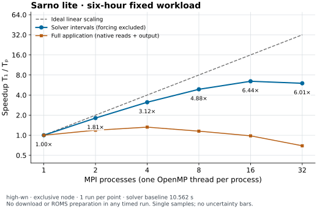
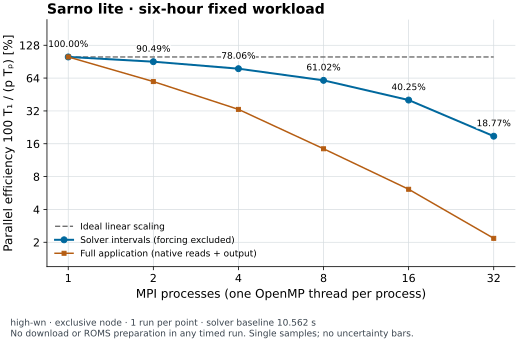
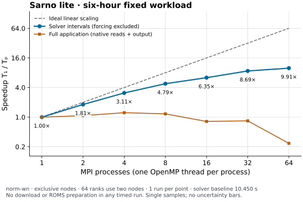
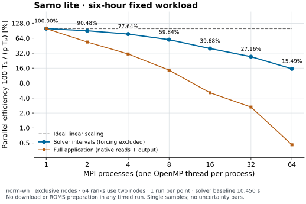
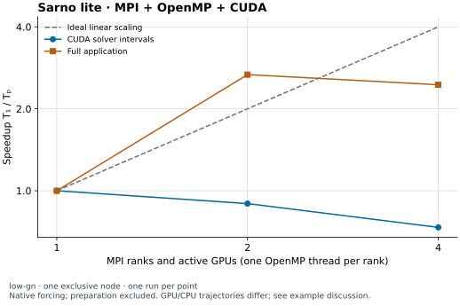
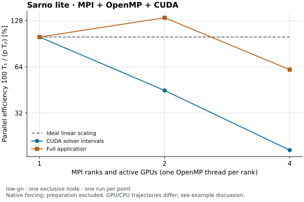
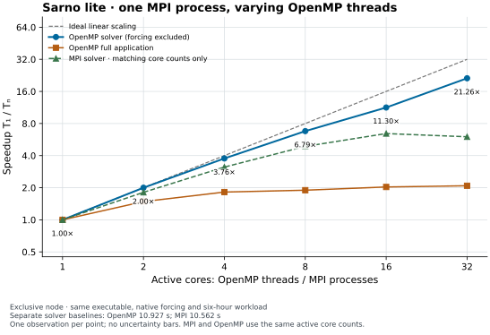
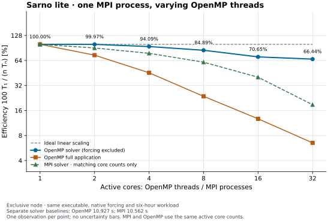

# Sarno River: six-hour coastal release

## Scientific objective

Follow a passive stochastic release near the Sarno River mouth from **2021-07-01 09:00 to 15:00 UTC**. The diagnostic question is how selected particles spread horizontally and occupy the model's near-surface vertical coordinate over six hours. This is a conditional model result, not pollutant-mass exposure, an observational validation, or a search-area probability. No leeway object model is selected.

## Prerequisites and required fields

Use the serial C++17 application (or the MPI build described below) with NetCDF C++4, built as described in the [build guide](../../../docs/build.md). The provided Slurm wrapper requires the host's four environment modules, `high-wn`, curl, and `ncdump`. It requests one node, one CPU, 32 GiB RAM, and one hour. Data and all run outputs live under **`data/wacomm-sarno-lite/`**, which is ignored by Git; archive it separately. Reserve at least 40 GiB for ROMS files, normalized native forcing, snapshots, and gridded output. The [input staging note](data.md) identifies where external data belongs.

Download the six files with hours **09, 10, 11, 13, 14, 15** from the [provider archive](https://data.meteo.uniparthenope.it/files/rms3/d03/history/2021/07/01/), using names `rms3_d03_20210701ZHH00.nc`. Each file is 2,816,026,296 bytes in the recorded run. The provider's 12:00 record is absent. The existing solver interpolates forcing between 11:00 and 13:00; no file or observational value is fabricated to fill this gap.

ROMS fields include wet/dry masks, longitude/latitude in degrees east/north, `h` and `zeta` in metres, `s_rho`/`s_w` dimensionless vertical coordinates, staggered `u`/`v` and `w` in m s⁻¹, `AKt` in m² s⁻¹, and chronological `ocean_time` in seconds since 1968-05-23 00:00:00. The supplied grid is 1,135 × 1,528 with 30 rho levels. The source GeoJSON is `sources-sarno_river.json`, at 14.466590881347654°E, 40.72813686316017°N. See [ROMS normalization](../../../docs/adapters.md) and [model limitations](../../../docs/model.md).

## Configuration and exact commands

`wacomm-sarno-lite.json` selects `dry=false`, the ROMS adapter, seed 5489, random particle transport, deterministic source positions, forward tracking, upper reflection, lower constraint, and horizontal kill. `io.save_input=true` saves normalized native forcing to `processed-6h/`; `io.save_history="nc"` saves particle snapshots to `snapshots-6h/`; `output-6h/` receives gridded particle counts. Restart loading is disabled. Source, closure, decay, and diffusion settings retain the historical example values.

From the repository root:

```bash
bash examples/wacomm-sarno-lite/tools/run_sarno_lite.sh
```

The script downloads missing available forcing through temporary `.part` files, stages the checked-in configuration and source, copies the executable, records provenance, and submits `examples/wacomm-sarno-lite/tools/sarno_lite_job.sh`. It refuses to overwrite existing six-hour outputs. Archive those directories before deliberately repeating the run. For an already staged configuration, the equivalent solver command, executed inside the run root, is:

```bash
./wacommplusplus wacomm-sarno-lite-6h.json
```

The configured source parameter is named `particlesPerHour`, but the current solver invokes emission once at each forcing-interval start. The two-hour gap therefore yields **five batches of 10,000**, at 09, 10, 11, 13, and 14 UTC: **50,000 emitted**, not 60,000. This scenario is not a constant hourly release through the missing interval. No governing equation or emission implementation was changed for this run.

## Expected outputs and verification

Slurm job **6210** ran on `high-wn` and the application returned **0**. It covered five intervals spanning exactly 21,600 seconds. The final 15:00 input is a boundary record and produces no extra integration interval; the corresponding warning is expected. Snapshots are labeled by their actual `particle_time` at 10, 11, 13, 14, and 15 UTC, while gridded output filenames use interval-start hours. There is no 12:00 snapshot.

| Physical snapshot (UTC) | Selected active particles |
|---|---:|
| 10:00 | 9,926 |
| 11:00 | 19,003 |
| 13:00 | 24,561 |
| 14:00 | 32,393 |
| 15:00 | 40,109 |

The final selected-member median distance from the source is **132 m**, with a 90th percentile of **262 m**. These are unweighted descriptive great-circle distances, not confidence radii. Final stored depths, after converting the positive-up coordinate to positive-down display, have median **0.206 mm** and 10–90% member range **0.051–0.479 mm**. The units expose the near-surface numerical output; they do not imply millimetre-scale physical accuracy.

Run `ctest --test-dir build --output-on-failure`. The portable and serial regression suites cover forward/backward physical intervals, restart continuity, adapters, and configuration. Relevant particle assertions use 1e-8 fractional-grid tolerance for restart position and 1e-12 s for age; these are regression tolerances, not coastal forecast error bounds. For run repetition, require identical particle counts/IDs and seed, then compare physical-time coordinates and output checksums on the archived compiler/backend. Native reuse is a separate equivalence check and has not been claimed from merely generating the files.

## Publication figures

The read-only tool produces SVG and PDF with vector labels/contours and rasterized dense point layers, plus 400 dpi PNG. It records input, script, and output checksums, software versions, selection counts, bins, and statistics in JSON. It needs Python 3.11 and the pinned packages in `tools/requirements-figures.txt`:

```bash
python3.11 -m venv data/wacomm-sarno-lite/venv
data/wacomm-sarno-lite/venv/bin/python -m pip install -r tools/requirements-figures.txt
MPLCONFIGDIR=/tmp/wacomm-mpl data/wacomm-sarno-lite/venv/bin/python \
  examples/wacomm-sarno-lite/tools/publication_figures.py data/wacomm-sarno-lite/snapshots-6h/*.nc \
  --grid data/wacomm-sarno-lite/roms/rms3_d03_20210701Z0900.nc \
  --map-crs EPSG:4326 --extent 14.461 14.474 40.721 40.733 \
  --source 14.466590881347654 40.72813686316017 \
  --depth-bin 0.0005 --depth-unit mm \
  --note '12:00 forcing unavailable: interpolation spans 11:00–13:00 UTC; no 12:00 release batch.' \
  --output-dir examples/wacomm-sarno-lite/docs/figures
```


**Figure 1 — Model result.** EPSG:4326 Plate Carrée, 14.461–14.474°E and 40.721–40.733°N, 1 July 2021. Colors encode particle age in hours; the star is the source. Geography comes solely from the downloaded ROMS grid: the 0.5 mask contour is a visual wet/dry boundary, not a surveyed coastline or the exact solver shoreline decision. Some active points appear on the shaded side because mask-contour rendering and solver boundary logic differ. Bathymetry contours are in metres. No external basemap is downloaded, and point overplotting is not a density estimator. [PDF](figures/sarno-maps.pdf) · [400 dpi PNG](figures/sarno-maps.png).


**Figure 2 — Model result.** Vertical distribution uses fixed 0.5 mm bins and counts divided by bin width, without mass weighting or probability normalization. The radial section collapses azimuth and is not a directional transect. The last panel shows sample quantiles at recorded times only, not a confidence interval. The writer derives depth from bathymetry and sigma coordinates without instantaneous free-surface displacement; “model datum” avoids implying an observed depth below the instantaneous sea surface. Panel axis ranges differ to reveal the near-surface coordinates. [PDF](figures/sarno-profiles.pdf) · [400 dpi PNG](figures/sarno-profiles.png).

The [figure manifest](figures/sarno-figure-manifest.json) contains exact statistics and input hashes. The [run record](figures/run-record.json) binds these results to the submitted configuration, binary, forcing, and output checksums. The [diagnostic methods](../../../docs/trajectory-diagnostics.md#publication-maps-and-profiles) define estimators, units, missing data, and unsupported geometry.

## Native forcing for future runs

The saved native names are `processed-6h/ocm3_d03_20210701ZHH.nc` at hours 09, 10, 11, 13, 14, 15, without the downloaded filename's trailing minutes. To reuse them, set `ocean_model="WaComM"`, `base_path="processed-6h/"`, those basenames in `nc_inputs`, and `save_input=false`. Use separate gridded-output and snapshot roots. The staged `wacomm-sarno-lite-native-6h.json` provides that configuration. Saved windows may already contain the adjacent boundary record used for interpolation. Retain the same physical-time ordering and source/seed settings.

## Limitations, interpretation, and reproducibility

The six-hour realization depends on forcing, the missing 12:00 record, interval-based source batches, grid resolution, closures, and the documented legacy stochastic displacement. Numerical repeatability is not observational validation; the particle rate is not a contaminant mass flux. The finite member cloud and depth quantiles do not estimate calibrated probabilities or forecast confidence. These figures take their map/profile presentation cues from the OpenDrift gallery but do not run OpenDrift or establish agreement with it.

Archive Git base revision and working-tree changes, full resolved and input configurations, source/forcing/native/restart/output checksums, seed, compiler/CMake and library versions, module list, Slurm allocation and job logs, timestep and test tolerances, plotting environment, commands, and figure checksums. The run used the earlier recorded source revision with the session's build changes; the numerical C++ sources were unchanged. Run data are intentionally outside Git; the small figures and their provenance are versioned with this guide.

## Two-process MPI calculation

Build with `USE_MPI=ON`, `USE_OMP=OFF`, `USE_CUDA=OFF`, `USE_EMPI=OFF`, `USE_OPENACC=OFF`, and `WACOMM_BOOTSTRAP_PARALLEL_IO=OFF`, using the [MPI build command](../../../docs/build.md#mpi-build-for-the-sarno-slurm-run). Submit from the repository root:

```bash
bash examples/wacomm-sarno-lite/tools/run_sarno_lite.sh --mpi
```

This requests `high-wn`, one node, two tasks, one CPU per task, 64 GiB total memory, and one hour. The job launches `mpirun --np "$SLURM_NTASKS" --bind-to core --report-bindings ./wacommplusplus wacomm-sarno-lite-6h.json` within the Slurm allocation. The wrapper checks the build's MPI setting. Its run root is `data/wacomm-sarno-lite/mpi2/`, with a relative symlink to the shared `../roms/` inputs. Allow additional disk space for another set of outputs and normalized forcing. Existing serial output remains available for comparison. Both modes use the same checked-in configuration, `dry=false`, seed 5489, and 09:00–15:00 UTC forcing window; the missing 12:00 record and all scientific limitations above still apply.

Job **6222** ran on `wn01` with OpenMPI 4.1.4, two ranks bound to separate cores, and application exit code **0**. OpenMPI logged an OpenFabrics device initialization warning; this successful single-node execution provides no inter-node fabric validation. All five saved particle snapshots exactly match serial job 6210 when ordered by integer identity, including inactive particles and every stored variable. Absolute and relative numeric tolerances are zero. This is backend verification for this case, not observational validation or a guarantee for every platform, rank count, or configuration. The figures above therefore also represent the matching MPI particle state.

```bash
data/wacomm-sarno-lite/venv/bin/python tools/compare_particle_snapshots.py \
  data/wacomm-sarno-lite/snapshots-6h \
  data/wacomm-sarno-lite/mpi2/snapshots-6h \
  --json figures/mpi2-comparison.json
```

The [comparison report](figures/mpi2-comparison.json) records each physical time, stored particle count, variable list, and both input hashes. The [MPI run record](figures/mpi2-run-record.json) archives configuration, dependency versions, revision, working diff, Slurm allocation, binding log, and input/output checksums. Runtime provenance remains under `data/wacomm-sarno-lite/mpi2/provenance/`; preserve it with the data. Comparison excludes global build/configuration attributes, which legitimately differ between builds; inspect provenance separately. Gridded counts and normalized forcing are archived but are outside this particle-state comparison.

## MPI/OpenMP strong scaling

**Scientific and computational question.** How does solver time for this fixed six-hour passive-release calculation change with MPI process count when OpenMP is enabled but limited to one thread per rank? This experiment changes execution resources only. It reuses the saved native forcing described above; units, source batches, seed, physical interpretation, and missing-hour limitation remain applicable.

**Prerequisites and exact commands.** Use GNU 12.2.1, OpenMPI 4.1.4, CMake 4.4.3, the same four modules, and a Release build with MPI and OpenMP enabled and CUDA disabled. Keep the six downloaded ROMS files under `data/wacomm-sarno-lite/roms/`. Downloading is completed before preparation. The one-process preparation job rebuilds the six native inputs under `data/wacomm-sarno-lite/processed-6h/`; the performance sweep then shares those files read-only. Reserve disk space for the old forcing backup, regenerated forcing, and seven sets of particle/gridded outputs. From the repository root:

```bash
module load openssl/openssl-4.0.2
module load cmake/cmake-4.4.3
module load gcc-12.2.1/ompi-4.1.4_nccl
module load nvidia/cuda-12.8.0
cmake -S . -B build -DCMAKE_BUILD_TYPE=Release \
  -DUSE_MPI=ON -DUSE_OMP=ON -DUSE_CUDA=OFF \
  -DUSE_EMPI=OFF -DUSE_OPENACC=OFF -DWACOMM_BOOTSTRAP_PARALLEL_IO=OFF
cmake --build build --parallel 8
OMP_NUM_THREADS=1 ctest --test-dir build --output-on-failure
bash examples/wacomm-sarno-lite/tools/prepare_sarno_scaling.sh
# Wait for the preparation job to finish successfully and write its checksums.
bash examples/wacomm-sarno-lite/tools/run_sarno_scaling.sh
```

The preparation wrapper archives existing forcing as `processed-6h-before-scaling/`, stages a separate `preparation/` run, and submits one MPI process on `high-wn` with `dry=false`, ROMS input, and `save_input=true`. It writes fresh forcing directly into `processed-6h/`. Its calculation and checksum collection finish before benchmarking. The performance wrapper requires preparation exit code zero and verifies every prepared-file checksum before submission. Both wrappers refuse to overwrite their existing run/backup directories; archive them before repeating.

The performance wrapper checks Release/MPI/OpenMP/CUDA cache settings and submits six jobs with 1, 2, 4, 8, 16, and 32 MPI processes, in ascending order. Each requests `high-wn`, one exclusive node, all node memory (`--mem=0`), one CPU per task, and a one-hour limit. `afterany` dependencies serialize the jobs even if an earlier case fails; the analysis nevertheless rejects any failed or missing case. The node has 32 physical cores across two sockets. Each job uses `mpirun --map-by core --bind-to core --report-bindings`, `OMP_NUM_THREADS=1`, `OMP_THREAD_LIMIT=1`, `OMP_DYNAMIC=FALSE`, `OMP_PROC_BIND=TRUE`, and `OMP_PLACES=cores`. OpenMP support is compiled in; this sweep does not test more than one OpenMP worker per rank.

**Outputs and verification.** Each run has its own `data/wacomm-sarno-lite/scaling/pN/` root and shares the read-only `processed-6h/` files through a relative symlink. The wrapper derives the run configuration from `examples/wacomm-sarno-lite/wacomm-sarno-lite.json`, setting `ocean_model="WaComM"`, `base_path="processed-6h/"`, `nc_inputs` to `ocm3_d03_20210701ZHH.nc` for hours 09, 10, 11, 13, 14, 15, and `save_input=false`. It retains `dry=false`, all scientific settings, particle snapshots, and gridded output. No ROMS input is opened and the normalized forcing is not rewritten. The shared loader reuses already-present boundary times only after exact agreement of all stored dynamic fields; conflicts fail rather than creating duplicate intervals. The wrapper refuses an existing `scaling/` root; archive the whole directory before repeating the experiment. After all jobs complete, use the optional Python environment above:

```bash
MPLCONFIGDIR=/tmp/wacomm-mpl data/wacomm-sarno-lite/venv/bin/python \
  examples/wacomm-sarno-lite/tools/scaling_figures.py data/wacomm-sarno-lite/scaling \
  --output-dir figures/scaling
```

The collector verifies identical executable, configuration, and source hashes, recorded rank/thread counts, successful exits, and exact agreement of every stored particle variable at each physical time with the one-rank baseline. Numeric tolerances are zero after integer-ID ordering, with identical missing-value masks required. Global build attributes, gridded output, and native forcing are outside this particle comparison. It refuses missing runs or nonpositive/non-finite times. This is backend verification for this workload, not observational validation.

**Timing method.** The primary measurement $T_p$ is the sum of five solver-interval durations in seconds for $p$ MPI processes (dimensionless). A barrier waits for every rank to finish loading/preparing its forcing before rank zero starts a monotonic `steady_clock` timer. The interval includes source emission, MPI scatter/gather, particle updates, and concentration/mask calculation. A second barrier after timing prevents other ranks from starting the next forcing load while rank zero is still timed. Downloading, ROMS conversion, native-file reads, initialization outside the solver interval, and snapshot/gridded writes are excluded from $T_p$. Thus forcing downloading and preparation cannot enter the measured solver duration. These barriers are timing/ordering operations and do not change trajectories, stochastic keys, physical time, or source schedules.

Speedup is $S_p=T_1/T_p$, and efficiency is $E_p=S_p/p$, displayed as percent. A secondary series uses full application elapsed time $A_p$, measured by GNU `time` around `mpirun`, with separate ratios $A_1/A_p$ and $A_1/(pA_p)$. It includes native-file reads and output writes, but still excludes the separate download/preparation job, staging, checksums, and queue wait. Both baselines use the same Release MPI/OpenMP executable as the other points; the preparation, earlier serial, and two-rank jobs are not timing baselines. Efficiency counts active ranks, not all 32 exclusively reserved cores. The [diagnostic methods](../../../docs/trajectory-diagnostics.md#strong-scaling-figures) define timing boundaries, estimators, and inference limits.



**Figure 3 — Computational diagnostic.** Fixed six-hour workload, one OpenMP thread per MPI rank, exclusive `high-wn` node. Both axes are logarithmic; the dashed line is ideal $S_p=p$. Blue is the solver measurement with forcing excluded; orange is full application elapsed time with native reads and writes. Each point is one timed run. [PDF](figures/scaling/sarno-speedup.pdf) · [400 dpi PNG](figures/scaling/sarno-speedup.png).



**Figure 4 — Computational diagnostic.** Efficiency is $100T_1/(pT_p)$ percent, with logarithmic axes. Blue uses solver time; orange uses the separately normalized full-application time. The dashed 100% reference represents ideal linear scaling, not a fitted prediction. There are no uncertainty bars because there is only one observation per process count. [PDF](figures/scaling/sarno-efficiency.pdf) · [400 dpi PNG](figures/scaling/sarno-efficiency.png).

**Measured results.** Preparation job **6255** rebuilt the native forcing with exit code zero. Performance jobs **6256–6261** all completed on `wn01` (two Intel Xeon Gold 5218 sockets, 32 physical cores total) with exit code zero. All five particle snapshots agree exactly across every process count; the one-process replay also matches the preparation and earlier serial results. The regenerated native-file checksums match the earlier forcing files byte-for-byte. The [preparation-to-serial comparison](figures/scaling/preparation-serial-comparison.json) and [native-to-preparation comparison](figures/scaling/native-preparation-comparison.json) retain the input hashes and exact variable checks.

| MPI processes | Job | Solver time (s) | Solver speedup | Solver efficiency | Application time (s) | Application speedup |
|---:|---:|---:|---:|---:|---:|---:|
| 1 | 6256 | 10.5618 | 1.000× | 100.00% | 24.86 | 1.000× |
| 2 | 6257 | 5.8360 | 1.810× | 90.49% | 20.90 | 1.189× |
| 4 | 6258 | 3.3828 | 3.122× | 78.06% | 18.80 | 1.322× |
| 8 | 6259 | 2.1635 | 4.882× | 61.02% | 21.59 | 1.151× |
| 16 | 6260 | 1.6399 | 6.440× | 40.25% | 25.38 | 0.980× |
| 32 | 6261 | 1.7583 | 6.007× | 18.77% | 35.76 | 0.695× |

**Discussion.** Solver time decreases from 10.5618 s at one process to 1.6399 s at 16 processes: **6.44× speedup and 40.25% efficiency**. At 32 processes it rises to 1.7583 s, giving **6.01× speedup and 18.77% efficiency**. Thus the best observed solver result is at 16 processes, while doubling to 32 gives no improvement in this single sweep. The falling efficiency shows that the additional ranks are not fully converted into reduced solver time. MPI overhead, fixed rank-zero concentration/mask work, memory bandwidth and socket placement are plausible contributors; the present measurements do not distinguish their individual effects or establish that the small 16-to-32 difference is repeatable.

The full application has a different optimum in this sweep: **18.80 s at four processes (1.32× speedup)**, versus 24.86 s at one and 35.76 s at 32. At 32 processes, the measured solver accounts for about 4.9% of elapsed application time. The remainder includes native-file I/O, initialization/array allocation, launch, synchronization outside the timed interval, and output. It cannot be attributed entirely to a single bottleneck. The primary blue series excludes forcing loading/preparation, so this full-runtime slowdown does not contaminate the reported solver ratios. Neither series includes downloading or ROMS-to-native regeneration.

These measurements favor 16 ranks for the solver phase and four ranks for this complete invocation, among the tested counts only. They are observations, not a statistically established optimum: each count has one sample, execution order is fixed, and cache state, turbo frequency and shared-storage behavior are uncontrolled. A replicated, randomized sweep is needed to assess variability and choose production resources confidently. The dashed ideal lines are reference limits, not expectations fitted to this small release.

**Limitations and interpretation.** This is one ascending, sequential sweep, without randomized order, replicated timings, or cache control. Every MPI process loads the full native ocean windows; particle decomposition does not distribute the environmental grid. Rank zero also computes gridded concentration and writes results. Native reads and writes affect only the secondary full-application series. MPI communication, rank-zero concentration work, and memory bandwidth can limit the primary solver series; the experiment does not isolate each individual cost. Amdahl (1967) explains the general limit imposed by serial work, but no serial fraction is fitted here. Results do not establish multi-node scaling, multi-thread OpenMP performance, a calibrated performance model, or a ranking on other hardware. MPI's OpenFabrics/UCX environment warnings are retained in the logs; successful same-node execution does not verify an inter-node transport.

**Reproducibility metadata.** The [scaling report](figures/scaling/scaling-results.json) contains preparation and performance job IDs, per-interval solver times, full elapsed times, ratios, complete configuration, compiler flags and CMake cache, Git revision and working diff, staged submission scripts, CPU topology, MPI/OpenMP environment, binding records, input/output checksums, exact particle comparisons, and plot hashes. GNU Release uses `-O3 -DNDEBUG` with `-fopenmp` and no fast-math option. Preserve all runtime data separately from Git. Earlier default-build, ROMS-forcing, and pre-fix native-boundary pilots were cancelled and excluded; they remain locally archived for traceability.

## Extended MPI performance test: 1–64 processes

**Question and method.** This repeat of the fixed six-hour passive Sarno calculation tests whether adding ranks beyond one 32-core node reduces solver time. The scientific configuration, saved native forcing, executable, seed, five physical intervals, and one OpenMP thread per MPI process are unchanged from the preceding sweep. Jobs **6285–6291** ran sequentially on `norm-wn`: 1–32 ranks used one exclusive 32-core node (`wn01`), while 64 ranks used two exclusive nodes (`wn01–wn02`). The 64-rank point therefore changes node count and communication topology as well as rank count. It is a two-node result, not a same-node continuation.

**Prerequisites and exact commands.** Use the Release MPI/OpenMP build, six prepared `processed-6h/` native files, and successful preparation checksums specified above. The wrapper refuses an existing suite directory. From the repository root, after the preparation job has completed:

```bash
bash examples/wacomm-sarno-lite/tools/run_sarno_scaling.sh scaling-64 norm-wn
# Wait for jobs 6285–6291 (or the newly submitted IDs) to finish.
MPLCONFIGDIR=/tmp/wacomm-mpl data/wacomm-sarno-lite/venv/bin/python \
  examples/wacomm-sarno-lite/tools/scaling_figures.py data/wacomm-sarno-lite/scaling-64 \
  --output-dir examples/wacomm-sarno-lite/figures/scaling-64
```

The same five-interval solver timer $T_p$ (seconds), full `mpirun` elapsed timer $A_p$ (seconds), and dimensionless estimators $S_p=T_1/T_p$ and $E_p=S_p/p$ apply. Preparation, downloading, and queue wait are excluded from both timers; native reads and writes are included only in $A_p$. The collector requires successful exits, expected rank/thread allocations, matching executable/configuration/source hashes, five positive physical-interval durations, and exact equality of all saved particle states by identity and physical time against the one-rank run. Its zero-tolerance comparison is numerical verification, not observational validation. Gridded outputs and forcing are outside the particle-state comparison; prepared forcing checksums are verified before submission. The complete [run report](figures/scaling-64/scaling-results.json) records job and input/output checksums, allocation, software and build provenance, interval times, comparisons, and figure hashes.



**Figure 7 — Computational diagnostic.** Blue is solver speedup, orange is full-application speedup, and gray is the ideal linear reference. The 64-rank point uses two nodes. Both axes are logarithmic; each point is one run without uncertainty bars. [PDF](figures/scaling-64/sarno-speedup.pdf) · [400 dpi PNG](figures/scaling-64/sarno-speedup.png).



**Figure 8 — Computational diagnostic.** Efficiency is $100T_1/(pT_p)$ percent for the solver and analogously $100A_1/(pA_p)$ percent for the complete application. The dashed line is ideal 100% efficiency, not a fitted prediction. [PDF](figures/scaling-64/sarno-efficiency.pdf) · [400 dpi PNG](figures/scaling-64/sarno-efficiency.png).

| MPI processes | Nodes | Job | Solver time (s) | Solver speedup | Solver efficiency | Application time (s) | Application speedup |
|---:|---:|---:|---:|---:|---:|---:|---:|
| 1 | 1 | 6285 | 10.4496 | 1.000× | 100.00% | 23.16 | 1.000× |
| 2 | 1 | 6286 | 5.7743 | 1.810× | 90.48% | 21.58 | 1.073× |
| 4 | 1 | 6287 | 3.3649 | 3.105× | 77.64% | 18.79 | 1.233× |
| 8 | 1 | 6288 | 2.1829 | 4.787× | 59.84% | 19.85 | 1.167× |
| 16 | 1 | 6289 | 1.6458 | 6.349× | 39.68% | 28.33 | 0.818× |
| 32 | 1 | 6290 | 1.2022 | 8.692× | 27.16% | 27.51 | 0.842× |
| 64 | 2 | 6291 | 1.0540 | 9.914× | 15.49% | 79.05 | 0.293× |

**Discussion and limits.** The fastest measured solver point is 64 ranks at 1.0540 s, 9.91× faster than one rank, but the gain from 32 to 64 ranks is only 0.1482 s while efficiency drops from 27.16% to 15.49%. The full invocation is fastest at four ranks (18.79 s); it takes 79.05 s at 64 ranks. At 64 ranks, solver intervals account for about 1.3% of full elapsed time. Every rank loads ocean windows, and the two-node run introduces inter-node communication and shared-storage traffic; these measurements do not isolate either cost or show which dominates. MPI emitted OpenFabrics initialization warnings, retained in the report, yet all jobs exited zero and particle states matched exactly. This is one ascending sweep with one sample per count and uncontrolled cache, I/O, and system variation. The difference from the earlier 1–32 sweep, especially at 32 ranks, shows why neither sweep establishes a stable performance optimum. These results do not validate multi-node scaling beyond two nodes or predict performance on other hardware.

## MPI, OpenMP, and CUDA performance diagnostic on `low-gn`

**Question and prerequisites.** How does this fixed six-hour passive Sarno workload run on one Tesla V100 per MPI rank when OpenMP is compiled in but limited to one thread? Use the same prepared native forcing, source file, seed 5489, and scientific configuration as the MPI sweep above. The Release executable must be built separately in `build-cuda` with `USE_MPI=ON`, `USE_OMP=ON`, `USE_CUDA=ON`, `USE_EMPI=OFF`, `USE_OPENACC=OFF`, and `CMAKE_CUDA_ARCHITECTURES=70` for the V100. The local build reused the existing repository's nlohmann/json and NetCDF dependencies; its complete cache, compiler flags, staged binary checksum, and job environment are in the [report](figures/cuda-scaling/cuda-scaling-results.json). CUDA 12.8.0, GNU 12.2.1, OpenMPI 4.1.4, and CMake 4.4.3 were loaded. The CUDA kernel uses 128 threads per block because the previous 512-thread launch exceeded V100 resource limits; the renamed device-local forcing-error helper resolves an overload ambiguity without changing its calculation.

**Exact commands and allocation.** From the repository root, after completing the preparation job and the CPU build described above (whose checked-in dependency cache and static libraries the CUDA build reuses):

```bash
bash examples/wacomm-sarno-lite/tools/build_sarno_cuda.sh
bash examples/wacomm-sarno-lite/tools/run_sarno_cuda_scaling.sh
# Wait for the three low-gn jobs to exit successfully.
MPLCONFIGDIR=/tmp/wacomm-mpl data/wacomm-sarno-lite/venv/bin/python \
  examples/wacomm-sarno-lite/tools/cuda_scaling_figures.py data/wacomm-sarno-lite/cuda-scaling \
  --output-dir examples/wacomm-sarno-lite/figures/cuda-scaling
```

The wrapper submits 1, 2, and 4 ranks sequentially to one exclusive `low-gn` node, reserving all four Tesla GPUs and one CPU per rank. It pins each local rank to a distinct GPU with `CUDA_VISIBLE_DEVICES` and sets `OMP_NUM_THREADS=OMP_THREAD_LIMIT=1`. At one and two ranks, unused reserved GPUs do no work; efficiency divides by active ranks/GPUs. It refuses to overwrite an existing run directory and verifies prepared-forcing checksums before submission. Each run reads the same native forcing through a symlink, with ROMS conversion and normalized-forcing writes disabled. The output directory contains five physical-time particle snapshots and gridded history files. The collector verifies binary/configuration/source hashes, successful exits, one visible GPU per rank, distinct rank/GPU bindings, exactly five solver intervals, and exact equality of all saved particle states among the three CUDA runs. This verifies CUDA rank decomposition for this workload only.

**Timing and estimators.** Let $T_p$ be the sum of five barrier-bounded solver intervals in seconds for $p$ active MPI ranks/GPUs (dimensionless). It excludes native forcing reads, output writes, and the earlier download/preparation job. Full elapsed time $A_p$ includes native reads, launch, solver, and writes, but excludes queue wait and preparation. The dimensionless speedup is $T_1/T_p$ and efficiency is $T_1/(pT_p)$; the application series substitutes $A_p$. These archived measurements are computational diagnostics, not a validated scientific speedup claim, because their CPU–CUDA equivalence check below failed.



**Figure 9 — Computational diagnostic.** Blue shows CUDA solver speedup, orange full-application speedup, and gray ideal linear scaling. All runs use one `low-gn` node, with one OpenMP thread and one active GPU per rank. Both axes are logarithmic; each point is one run. [PDF](figures/cuda-scaling/sarno-cuda-speedup.pdf) · [400 dpi PNG](figures/cuda-scaling/sarno-cuda-speedup.png).



**Figure 10 — Computational diagnostic.** Efficiency divides each separately normalized speedup by active ranks/GPUs. The 100% line is an ideal reference. There are no uncertainty bars because each count has one sample. [PDF](figures/cuda-scaling/sarno-cuda-efficiency.pdf) · [400 dpi PNG](figures/cuda-scaling/sarno-cuda-efficiency.png).

| MPI ranks / active GPUs | Job | Solver time (s) | Solver speedup | Solver efficiency | Application time (s) | Application speedup |
|---:|---:|---:|---:|---:|---:|---:|
| 1 | 6346 | 2.9535 | 1.000× | 100.00% | 52.35 | 1.000× |
| 2 | 6347 | 3.2931 | 0.897× | 44.84% | 19.60 | 2.671× |
| 4 | 6348 | 4.0267 | 0.733× | 18.34% | 21.36 | 2.451× |

**Discussion and scientific limit.** The solver slows as active GPUs increase on this small particle release: 2.9535 s at one rank, 4.0267 s at four. The complete application is fastest at two ranks (19.60 s), but the unusually slow one-rank elapsed time (52.35 s) is one unreplicated observation and may reflect cold storage or other uncontrolled startup costs. GPU-rank comparisons pass exact identity and state checks at every saved physical time. The CPU one-rank and CUDA one-rank states do **not** pass the repository's zero-tolerance comparison: at 10:00 UTC, longitude differs by up to 1.27×10⁻⁸ degrees, latitude by 8.36×10⁻¹⁰ degrees, and depth by 9.53×10⁻⁸ m; at 14:00, the two outputs differ by one active particle (32,393 CPU versus 32,394 CUDA). The CUDA particle parity test also failed its position assertion in that run. These archived observations indicated a backend-equivalence problem, so the charts characterize runtime of the tested CUDA implementation but do not establish performance of a scientifically interchangeable solver. They cannot justify replacing the CPU backend for this case.

These observations describe the archived pre-fix run. Subsequent metric and interpolation corrections passed the synthetic CPU/CUDA particle parity test on `gn03` in Slurm job 6358. The archived figures remain computational diagnostics of the earlier implementation.

**Post-fix CPU/CUDA application consistency.** On 13 September 2026, CPU job 6360 and dependent CUDA job 6361 each ran the same six-hour native-forcing configuration on `gn03`, with one MPI rank, one OpenMP thread, seed 5489, and the same source file. The CPU binary was rebuilt from the same revision and source as the CUDA binary. Both exited zero. The exact snapshot comparator first reported a depth difference at 10:00 UTC; exact floating-point equality is therefore not claimed. After sorting by integer particle ID at each of five physical times, all IDs, counts, object types, drift sides, health values, ages, and times agree exactly. The largest great-circle horizontal separation is 2.19×10⁻⁷ m, the largest depth difference 2.25×10⁻⁹ m, and the largest grid-index difference 2.66×10⁻⁹. These pass the stated absolute acceptance limits of 10⁻⁶ m horizontal distance, 10⁻⁸ m depth, and 10⁻⁸ for dimensionless grid indices. All variables in the five gridded output files agree exactly. The [machine-readable report](figures/gn03-cpu-gpu-consistency.json) records per-time maxima, particle counts, file hashes, executable hashes, and the common configuration hash. Horizontal distance uses a spherical great-circle formula with radius 6,371,000 m; the limits are numerical equivalence criteria, not estimated scientific error or observational validation. The earlier one-particle status divergence is absent in this rerun. The runtime archive is `data/wacomm-sarno-lite/cpu-gpu-gn03-20260913/` and retains both job logs, modules, Slurm allocations, configurations, binaries, and output checksums.

An attempted eight-rank job on two `low-gn` nodes reached the last forcing file but did not exit; all eight ranks continued spinning while GPU utilization was zero. It was cancelled, and its dependent 16-rank job was cancelled before starting. Their incomplete timings are excluded from the plots and table. The completed sweep has one run per count, fixed ascending order, uncontrolled cache and I/O conditions, and no uncertainty estimate. The report preserves the completed job IDs, timing intervals, GPU mapping, platform/build metadata, checksums, comparison results, and figure hashes. The cancelled multi-node logs remain in the local runtime archive, outside Git. This performance observation is separate from scientific validation; the passive-release assumptions, forcing fields and units, missing 12:00 record, and physical interpretation described earlier still apply. The Amdahl (1967) reference below gives context for imperfect scaling, without implying a fitted serial fraction here.

## OpenMP strong scaling and MPI comparison

**Question and fixed workload.** Compare one MPI process with 1, 2, 4, 8, 16, and 32 OpenMP threads against the MPI sweep above at the same active core counts. The physical question, six-hour window, seed 5489, five source batches, native fields and units, boundaries, and missing 12:00 forcing limitation are unchanged. This is computational verification and performance evidence for the passive-release configuration, not observational validation.

**Prerequisites and exact command.** Reuse the Release MPI/OpenMP executable with CUDA disabled, the successful one-process preparation job, and its six `processed-6h/` files. The wrapper requires the build executable to be byte-identical to `scaling/p1/wacommplusplus`; a rebuilt binary with different provenance or compiler settings requires a new matched MPI baseline. Native inputs are checked against preparation checksums before submission. The partition is `high-wn`; `high-w` is not a configured partition on this host.

```bash
bash examples/wacomm-sarno-lite/tools/run_sarno_openmp_scaling.sh high-wn
```

The wrapper stages `data/wacomm-sarno-lite/openmp-scaling/tN/`, copies the exact MPI scientific configuration, and submits jobs sequentially with `--nodes=1 --ntasks=1 --cpus-per-task=N --exclusive --mem=0 --time=01:00:00`. Each job reserves the full node; efficiency divides by active threads, not all reserved cores. It launches `mpirun --np 1 --map-by slot:PE=N --bind-to core --report-bindings`, with `OMP_NUM_THREADS=N`, `OMP_THREAD_LIMIT=N`, `OMP_DYNAMIC=FALSE`, `OMP_PROC_BIND=SPREAD`, and `OMP_PLACES=cores`. The OpenMP runtime displays its environment and thread affinity for verification. These settings spread threads within the process's allocated core set; they do not promise equal NUMA locality of every array. The 32-core node has two 16-core Intel Xeon Gold 5218 sockets. Existing OpenMP run directories must be archived before a repeat.

**Outputs, timing, and verification.** Runs read shared native forcing with `ocean_model="WaComM"` and `save_input=false`, retaining particle snapshots and gridded counts. There is no downloading or forcing regeneration in this sweep. The same synchronized solver timers exclude forcing loading/preparation and file writes; the secondary full-application timer includes native reads, initialization, and output. Let $n$ be the dimensionless OpenMP thread count and $T_n$ the sum of five solver durations in seconds. Speedup is $T_1/T_n$ and efficiency is $T_1/(nT_n)$, displayed in percent. Each sweep uses its own one-core baseline; absolute times are also reported to expose baseline differences. Full-application ratios use a separate full-runtime baseline.

```bash
MPLCONFIGDIR=/tmp/wacomm-mpl data/wacomm-sarno-lite/venv/bin/python \
  examples/wacomm-sarno-lite/tools/openmp_scaling_figures.py data/wacomm-sarno-lite/openmp-scaling \
  --mpi-root data/wacomm-sarno-lite/scaling \
  --mpi-report figures/scaling/scaling-results.json \
  --output-dir figures/openmp-scaling
```

The collector requires all six successful runs, positive finite durations for the five physical intervals, one process, recorded thread/allocation settings, and identical executable/configuration/source hashes to the MPI reference. It compares every saved particle variable to MPI one-process output by exact integer identity and physical time, with zero numeric tolerance and identical masks. Global build attributes, gridded fields, and native forcing are outside that particle comparison. Forcing manifest equality and archived MPI log hashes are checked separately. No missing point is imputed. The [OpenMP report](figures/openmp-scaling/openmp-scaling-results.json) archives the complete configuration, timing intervals, job IDs, allocation, affinity, module/platform/build provenance, hashes, comparisons, and figure hashes.



**Figure 5 — Computational diagnostic.** One MPI process, six OpenMP thread counts; blue measures the solver with forcing excluded, orange measures full application elapsed time, and green shows the historical MPI solver at matching active cores. Each series uses its own one-core baseline. The dashed gray line is ideal linear scaling; both axes are logarithmic. [PDF](figures/openmp-scaling/sarno-openmp-speedup.pdf) · [400 dpi PNG](figures/openmp-scaling/sarno-openmp-speedup.png).



**Figure 6 — Computational diagnostic.** Efficiency divides the independently normalized speedup by active threads or ranks. The gray 100% line is ideal scaling, not a fitted result. There is one observation per point and no uncertainty estimate. [PDF](figures/openmp-scaling/sarno-openmp-efficiency.pdf) · [400 dpi PNG](figures/openmp-scaling/sarno-openmp-efficiency.png).

**Measured results.** Jobs **6262–6267** completed on `wn01` in `high-wn`, all with exit code zero. All five saved particle snapshots match the MPI one-process reference exactly at every thread count. All [13 core/diagnostic checks](figures/openmp-scaling/validation-core-diagnostics.log) passed without skips. Affinity records place the workers on distinct cores: counts through 16 use cores on the first socket, and 32 threads span both sockets. GNU OpenMP does not print a level-1 team-affinity line for its one-thread execution; its single resolved OpenMP place and OpenMPI core binding verify that case.

| OpenMP threads | Job | Solver time (s) | Solver speedup | Solver efficiency | Application time (s) | Application speedup |
|---:|---:|---:|---:|---:|---:|---:|
| 1 | 6262 | 10.9269 | 1.000× | 100.00% | 24.41 | 1.000× |
| 2 | 6263 | 5.4651 | 1.999× | 99.97% | 16.46 | 1.483× |
| 4 | 6264 | 2.9034 | 3.763× | 94.09% | 13.41 | 1.820× |
| 8 | 6265 | 1.6090 | 6.791× | 84.89% | 12.88 | 1.895× |
| 16 | 6266 | 0.9667 | 11.303× | 70.65% | 12.01 | 2.032× |
| 32 | 6267 | 0.5139 | 21.261× | 66.44% | 11.70 | 2.086× |

**Observed scaling.** Solver time falls from **10.9269 s** at one thread to **0.5139 s** at 32 threads, a **21.26× speedup with 66.44% efficiency**. Two threads are nearly ideal (99.97% efficiency); efficiency then decreases as overhead and work that does not scale perfectly become more important. Unlike the MPI sweep, OpenMP continues improving from 16 to 32 active cores in this experiment. The full application improves from **24.41 s to 11.70 s (2.09×)**, but gains after four threads are much smaller than solver gains. At 32 threads only about 4.4% of full runtime lies inside the measured solver intervals; native I/O, initialization, allocation, synchronization outside the interval, and output remain outside that primary timer. None of the benchmark times includes downloading or the separate forcing-regeneration job.

**Comparison with MPI.** At 16 active cores, OpenMP uses 0.9667 s for the solver versus MPI's 1.6399 s. At 32, the measured absolute solver-time ratio is **3.42× in favor of OpenMP** (0.5139 s versus 1.7583 s), and the application-time ratio is **3.06×** (11.70 s versus 35.76 s). MPI solver speedup peaks at 16 ranks (6.44×), then drops to 6.01× at 32; OpenMP reaches 21.26× at 32. MPI's best observed full-runtime point was four ranks (18.80 s), whereas OpenMP's lowest full runtime is at 32 threads (11.70 s). These are single-sweep observations, not statistically established optima.

The independently measured one-core solver baselines differ by **3.46%**: OpenMP 10.9269 s versus MPI 10.5618 s, even though the binary and physical results are identical. Separately normalized speedups therefore must not be divided and interpreted directly as absolute runtime ratios. The absolute 32-core comparison above avoids that baseline effect. Both sweeps show lower efficiency at larger core counts and much weaker full-application speedup than solver speedup; the major difference is OpenMP's continued solver improvement across the second socket, while the one-thread-per-rank MPI run levels off.

**Similarities, differences, and interpretation.** Both experiments use the same solver equations, seeded particles, forcing, binary, node, and physical intervals. Both retain work that does not divide perfectly with active core count, so ideal linear scaling is a reference rather than an expectation (Amdahl, 1967). MPI distributes particles among processes with separate ocean-array copies and scatter/gather communication; OpenMP threads share the one process's ocean arrays and particle storage. OpenMP also parallelizes concentration/mask loops that used one thread on MPI rank zero in the earlier sweep. Thus identical core counts do not imply identical memory traffic, communication, or available parallel work. These architectural differences can explain different scaling shapes, but the two elapsed-time measures do not identify individual bottleneck costs.

The MPI reference is historical, not interleaved or rerun alongside OpenMP. Each count has one sample, and filesystem caches, CPU frequency, NUMA first-touch placement, and background system behavior are uncontrolled. Affinity settings differ between processes and threads and are archived; runtime diagnostic overhead is not separately subtracted. Comparisons describe this fixed workload and execution policy, not statistically established superiority or a general recommendation for other particle counts, grids, or machines. No hybrid multi-rank/multi-thread or multi-node experiment is implied. Preserve the ignored runtime directories separately from Git for reproducibility.

## Shared performance evaluation

The [detailed Sarno performance evaluation](performance-evaluation.md) applies the repository protocol to 1,000, 10,000, 100,000, and 1,000,000 particles emitted per hour. It gives the exact launcher and collector commands, validation gates, all requested resource tuples, versioned charts, observed results, limitations, and per-run Codex review-note workflow. At 10,000 particles/hour, the validated CPU optimum is `1/32/0` at 0.519478 s median solver time; all one- through four-GPU timings for this workload are slower than that CPU point. Compare each other emission rate against its own baseline and select its CPU configuration independently.

## References


- Dagestad, K.-F., Röhrs, J., Breivik, Ø., and Ådlandsvik, B. (2018). OpenDrift v1.0: a generic framework for trajectory modelling. *Geoscientific Model Development*, 11, 1405–1420. [doi:10.5194/gmd-11-1405-2018](https://doi.org/10.5194/gmd-11-1405-2018).
- Montella, R., et al. (2023). A highly scalable high-performance Lagrangian transport and diffusion model for marine pollutants assessment. *Proceedings of PDP 2023*, 17–26. [doi:10.1109/PDP59025.2023.00012](https://doi.org/10.1109/PDP59025.2023.00012).

- OpenDrift Project. [Gallery](https://opendrift.github.io/gallery/index.html), [ROMS reader example](https://opendrift.github.io/gallery/example_roms_native.html), and [vertical mixing example](https://opendrift.github.io/gallery/example_vertical_mixing.html). Visualization/software provenance; not independent scientific validation.

- Amdahl, G. M. (1967). Validity of the single processor approach to achieving large scale computing capabilities. *AFIPS Conference Proceedings*, 30 (Spring Joint Computer Conference), 483–485. [doi:10.1145/1465482.1465560](https://doi.org/10.1145/1465482.1465560).
- Hoefler, T., and Belli, R. (2015). Scientific benchmarking of parallel computing systems: twelve ways to tell the masses when reporting performance results. *Proceedings of the International Conference for High Performance Computing, Networking, Storage and Analysis*, article 73, 1–12. [doi:10.1145/2807591.2807644](https://doi.org/10.1145/2807591.2807644).
