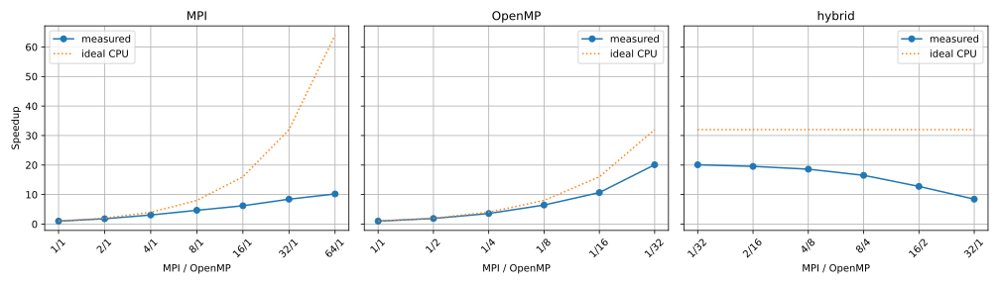
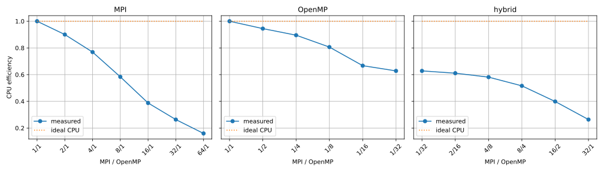
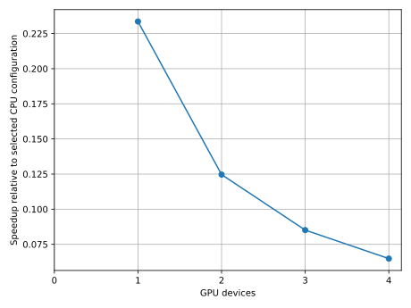
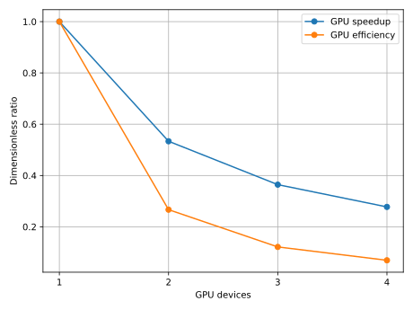
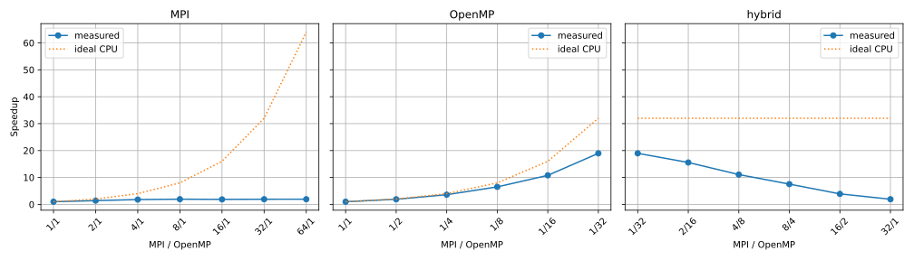
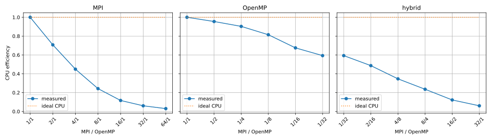
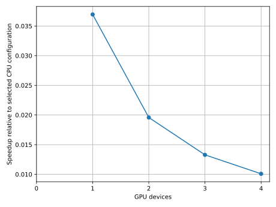

# Sarno passive-release performance evaluation

## Scientific question and controlled workload

This evaluation asks how execution time changes with MPI processes, OpenMP threads, and CUDA devices for a fixed seeded-stochastic passive Sarno River release, and how that resource choice changes as the hourly emission count increases. The physical interval is 1 July 2021, 09:00–15:00 UTC, with native WaComM forcing records at 09, 10, 11, 13, 14, and 15 UTC. The missing 12:00 record and its interpolation implications are described in the [example guide](README.md). The run has five physical solver intervals, `physics.random=true`, `physics.random_sources=false`, and seed 5489. The only scientific quantity varied between workload suites is the one GeoJSON source's `particlesPerHour`, with values 1,000, 10,000, 100,000, and 1,000,000 particles per hour. No drift-object model is selected. The word `sar` in historical paths does not change passive physics.

For each emission rate \(q\) (particles/hour), execute the complete 16-configuration CPU matrix in the [shared protocol](../../../docs/performance-evaluation.md): MPI-only `1,2,4,8,16,32,64` ranks with one thread; OpenMP-only `1,2,4,8,16,32` threads with one rank; and the 32-worker hybrid `1/32,2/16,4/8,8/4,16/2,32/1`. Overlapping tuples are measured once per replicate block. Select the overall CPU optimum from all valid CPU configurations at that same \(q\). When it requires two nodes, select the fastest one-node tuple separately as the GPU-compatible CPU reference, then measure that placement with \(g=0,1,2,3,4\) total devices on one node. Re-select both references for every \(q\); one workload's result is not imposed on another. The zero-GPU measurement is the GPU-compatible CPU point already collected at that rate.

All executions for one \(q\) use the same Release MPI/OpenMP/CUDA binary, resolved configuration, seed, checked source geometry, forcing hashes, and node class. CPU runs set `CUDA_VISIBLE_DEVICES=-1`. GPU runs expose exactly the first \(g\) devices from the Slurm allocation; the original Slurm mask, rank-level mask, topology, GPU details, and one-second utilization/memory/power samples are archived. A 64-rank CPU run occupies two identical 32-core GPU-node-class hosts and explicitly exports CUDA and OpenMP settings to remote MPI ranks. An exclusive Slurm node can advertise more GPUs than requested; the solver-visible mask, rather than the reservation alone, defines \(g\). The same native forcing is reused read-only and is not regenerated in timed runs.

Each configuration has one warm-up and three independently scheduled measured executions. The configuration order rotates between replicate blocks. For each execution, sum the same five positive finite, barrier-bounded solver intervals in seconds. Let \(T_{q,p,n,g}\) denote the median of the three sums. CPU speedup \(S_{q,p,n}=T_{q,1,1,0}/T_{q,p,n,0}\) and efficiency \(E_{q,p,n}=S_{q,p,n}/(pn)\) are dimensionless. For each \(q\), GPU incremental speedup is \(T_{q,p_q^*,n_q^*,0}/T_{q,p_q^*,n_q^*,g}\). Device scaling relative to one GPU is \(G_{q,g}=T_{q,p_q^*,n_q^*,1}/T_{q,p_q^*,n_q^*,g}\), with device efficiency \(G_{q,g}/g\) for \(g\geq1\). These GPU quantities do not treat a GPU as equivalent to a CPU core. Full-application elapsed time, including native reads and output writes but excluding download/preparation and queue wait, is recorded separately and is not substituted into solver charts.

## Execution and validation

From the repository root, use Python 3.11 with the versions in `tools/requirements-figures.txt`, a successful native-forcing preparation, and a Release build with `USE_MPI=ON`, `USE_OMP=ON`, and `USE_CUDA=ON`. Choose a unique immutable suite name for each \(q\). The exact commands for one rate are:

```bash
bash examples/wacomm-sarno-lite/tools/run_sarno_protocol.sh cpu sarno-protocol-q1000-20260914 norm-gn 1000
python3.11 examples/wacomm-sarno-lite/tools/sarno_protocol_collect.py data/wacomm-sarno-lite/sarno-protocol-q1000-20260914
bash examples/wacomm-sarno-lite/tools/run_sarno_protocol.sh gpu sarno-protocol-q1000-20260914 norm-gn 1000
python3.11 examples/wacomm-sarno-lite/tools/sarno_protocol_collect.py data/wacomm-sarno-lite/sarno-protocol-q1000-20260914
```

Repeat with unique roots and `10000`, `100000`, and `1000000`; the archived 10,000-particles/hour suite is `data/wacomm-sarno-lite/sarno-protocol-rotated-20260913`. The launcher creates the rate-specific source from the checked-in GeoJSON and archives the exact modified document. It never edits the checked-in source. After all four suites pass, run the reusable cross-workload processor:

An optional fifth launcher argument is a Slurm job ID that all newly submitted jobs must follow with `afterok`. Use it to serialize separate rate suites when the preceding suite's final one-node job is still queued. Record the dependency in `provenance/after-job-id.txt`; archive any scheduler-order amendment separately. A two-node point delayed by unavailable hardware remains required for a complete matrix, even if its one-node successors are allowed to run first under exclusive allocations. Report the actual order rather than presenting the intended rotation as the executed order.

For each fully validated suite, publish a compact versioned result record and its four charts with `python3.11 tools/performance_publish.py <suite-root> examples/wacomm-sarno-lite/docs/figures/performance-q<rate> --physical-window '2021-07-01T09:00:00Z/2021-07-01T15:00:00Z'`. The publisher requires the complete CPU/GPU matrix, rejects inconsistent rate and provenance metadata, and hashes the copied figures. Supply `--excluded-job <id>` for every failed or superseded scheduler attempt; preserve those raw logs outside Git.

```bash
python3.11 tools/performance_workload_scaling.py \
  --case 1000:data/wacomm-sarno-lite/sarno-protocol-q1000-20260914 \
  --case 10000:data/wacomm-sarno-lite/sarno-protocol-rotated-20260913 \
  --case 100000:data/wacomm-sarno-lite/sarno-protocol-q100000-20260914 \
  --case 1000000:data/wacomm-sarno-lite/sarno-protocol-q1000000-20260914 \
  --output-dir data/wacomm-sarno-lite/workload-evaluation-20260914
```

The Sarno collector rejects missing/duplicate/reordered physical intervals, nonpositive times, failed exits, inconsistent configuration/source/forcing/binary hashes, wrong process/thread/device counts, missing rank binding or GPU telemetry, and incomplete samples. It compares every particle variable by stable integer ID and physical time, requiring CPU exact equality. GPU discrete/time fields are exact; great-circle horizontal separation must be at most \(10^{-6}\) m, depth at most \(10^{-8}\) m, and each dimensionless grid index at most \(10^{-8}\). Every stored gridded variable must match exactly. These are numerical backend-equivalence limits based on the [post-fix application check](figures/gn03-cpu-gpu-consistency.json), not observational uncertainty estimates. A failed run remains in the archive with a Codex-ready diagnostic note and is excluded from all ratios. Each accepted resource tuple receives `run.json`, `validation.md`, and `codex-performance-review.md` in its run directory; aggregate charts and results are generated only after complete coverage. `tools/performance_workload_scaling.py` checks the common binary, forcing, configuration, hardware class, timing scope, per-rate source identity, and full CPU/GPU coverage across sizes. The Git revision is archived for each rate; byte-identical executable hashes, not equal documentation commit IDs, establish implementation identity across suites.

If a job fails after staging, preserve its logs and use `bash examples/wacomm-sarno-lite/tools/resume_sarno_protocol_cpu.sh <suite> norm-gn` or the corresponding `resume_sarno_protocol_gpu.sh`. The resume scripts skip successful samples, retain failed samples under distinct names, and preserve replicate-block order. Do not merge samples from a different build or scientific source into the same suite. The first 64-rank attempt in the 10,000-particles/hour series (job 6384) failed because remote ranks did not inherit the CPU device mask and entered CUDA, exhausting GPU memory. Explicit MPI export was verified by two-node pilot job 6426 and the formal run resumed with the failed warm-up retained. The first one-GPU attempt (job 6470) failed before the model started because that node's `nvidia-smi` rejected selective detail flags; a supported query and explicit device subsetting were used on retry. Neither failed attempt contributes timing data.

## Validated 10,000-particles/hour result

The three-block, five-interval CPU comparison selected `1/32/0` with median solver time **0.519478 s**. Relative to the one-rank/one-thread median of **10.438386 s**, this is **20.094× speedup** and **62.8% CPU efficiency**. The 32-worker hybrid `2/16/0` was close at **0.534059 s**; this observed 2.8% difference does not establish a universal ranking from three repetitions. The MPI-only 64-rank case took **1.023023 s**, with **10.203× speedup** and **15.9% efficiency** relative to the same baseline. It includes inter-node communication and is not a 64-core single-node result. All 16 CPU tuples, raw samples, medians, and ratios are retained in the [compact results record](figures/performance-q10000/results.json).



**Figure 6 — Computational diagnostic.** CPU speedup for the fixed six-hour 10,000-particles/hour workload; dotted lines are ideal CPU references. The panel labels identify MPI processes and OpenMP threads. Each point is a median of three independent solver-duration sums; no observational inference or confidence interval is implied.



**Figure 7 — Computational diagnostic.** CPU efficiency is speedup divided by active MPI-process/OpenMP-thread product, with the ideal reference at one. The two-node 64-rank point and single-node points share the same node class but different node counts.

At the selected `1/32` CPU configuration, median GPU solver times were **2.223740, 4.168407, 6.103719, and 8.013994 s** for one through four visible V100 devices, respectively. The corresponding incremental speedups over `1/32/0` are approximately **0.234, 0.125, 0.085, and 0.065**: every measured GPU count is slower for this fixed workload. Full-application medians were **10.81 s** for CPU and **12.49, 14.61, 16.59, 18.51 s** for one through four GPUs, respectively. All five particle snapshots and five gridded outputs passed the declared backend-equivalence check in each measured GPU repetition. Thus the performance comparison is about numerically interchangeable runs for this case, not about observational validity.



**Figure 8 — Computational diagnostic.** Incremental speedup uses the selected CPU median as the denominator for the same 10,000-particles/hour workload. Values below one mean the GPU run is slower; the zero-device point is the CPU reference.



**Figure 9 — Computational diagnostic.** GPU-device speedup and efficiency use the one-GPU run as their baseline and hold MPI/threads fixed at `1/32`. Zero devices have no GPU-device efficiency. The device-series decline should not be interpreted as a fitted serial fraction.

The CUDA implementation copies ocean state to each visible GPU and divides each rank's particle section across those devices. Those operations can outweigh useful particle work for a small release; this is a code-informed hypothesis, not a causal decomposition of the measured time. The one-second GPU monitor samples record nonzero kernel utilization and at most about 2.0 GiB framebuffer use on an active device, but can miss subsecond peaks. The 10,000-particles/hour result cannot predict the resource choice at another emission rate; each rate requires its own complete matrix and validated baseline. The earlier single-sample MPI/OpenMP figures and pre-fix CUDA figures in the [example guide](README.md) remain historical diagnostics and are not pooled into this series.

## Validated 1,000-particles/hour result

At 1,000 particles/hour, the same 16-point CPU matrix selects `1/32/0` with a median of **0.080232 s** against **1.522249 s** for `1/1/0`: **18.973× speedup** and **59.3% CPU efficiency**. The `2/16/0` hybrid takes **0.097767 s**. Two-node `64/1/0` takes **0.788919 s**, giving **1.930× speedup** and **3.0% efficiency**. The small release therefore leaves little solver work to amortize cross-node distribution at that point; a breakdown of communication and memory cost was not measured.

At the selected `1/32` CPU placement, the one-through-four-GPU medians are **2.171035, 4.097617, 6.040275, and 7.953921 s**. Their incremental speedups over `1/32/0` are approximately **0.0370, 0.0196, 0.0133, and 0.0101**. The CPU point is the fastest among all measured CPU and selected-CPU GPU configurations for this rate. These medians describe three valid repeated executions of the fixed six-hour workload; they do not determine a statistical or hardware-independent optimum. All measured particle states and gridded outputs pass the same declared equivalence policy as the 10,000-particles/hour series. The [compact 1,000-particle result record](figures/performance-q1000/results.json) retains all 20 tuples, raw solver and application times, ratios, provenance, and figure hashes.



**Figure 10 — Computational diagnostic.** Per-rate CPU speedup at 1,000 particles/hour; dotted lines show the ideal CPU reference, and labels give MPI processes/OpenMP threads.



**Figure 11 — Computational diagnostic.** CPU efficiency at 1,000 particles/hour, normalized by active MPI processes times OpenMP threads. The 64-rank point spans two nodes.



**Figure 12 — Computational diagnostic.** Device-count comparison at fixed `1/32` CPU placement; values below one are slower than the selected zero-GPU execution.


**Figure 13 — Computational diagnostic.** GPU-device speedup and efficiency use the one-device run at the same rate as baseline; no CPU-equivalent GPU efficiency is inferred.

## Completed 100,000- and 1,000,000-particles/hour suites

On 15 September 2026, the six delayed 64-rank jobs completed on matching `gn02` and `gn04` nodes after their partition was changed from `norm-gn` to `low-gn`; the archived scheduler amendment records the reason and commands. All 16 CPU tuples and all four GPU tuples have three valid measured repetitions, and every particle snapshot and gridded output passes the declared equivalence policy. The overall CPU optimum is `64/1/0` at both rates. Because that tuple spans two nodes, the corrected protocol uses the fastest one-node CPU tuple, `2/16/0`, as the fixed GPU reference.

| Particles/hour | One-worker median (s) | Overall CPU optimum | CPU median (s) | GPU reference median (s) | Best GPU tuple | GPU median (s) | GPU speedup over reference |
| ---: | ---: | :---: | ---: | ---: | :---: | ---: | ---: |
| 100,000 | 101.139 | `64/1/0` | 3.61455 | 4.83324 | `2/16/1` | 2.52182 | 1.917× |
| 1,000,000 | 997.166 | `64/1/0` | 26.9513 | 47.4450 | `2/16/1` | 6.29173 | 7.541× |

At both rates, one V100 is the fastest GPU-compatible placement. Two, three, and four devices are slower than one: their solver medians are 4.56246, 6.56244, and 8.55674 s at 100,000 particles/hour, and 7.93476, 9.75154, and 11.59361 s at 1,000,000 particles/hour. The application medians show the same choice: 13.23 s and 20.20 s with one device, versus 17.48 s and 60.20 s for the respective `2/16/0` CPU references. These are medians of three executions on one recorded node, without inferential error bars.

The compact [100,000-particle](figures/performance-q100000/results.json) and [1,000,000-particle](figures/performance-q1000000/results.json) records contain every sample, ratio, provenance hash, and chart hash. The [cross-workload record](figures/performance-workloads/workload-results.json) and [measured-choice table](figures/performance-workloads/workload-summary.md) compare all four rates. The result suggests a workload threshold between 10,000 and 100,000 particles/hour for this V100 implementation and hardware: CPU is fastest at the two smaller rates, while one GPU is fastest among the tested one-node GPU-compatible placements at the larger rates. This interval is a measured bracket, not an estimated crossover or a general hardware recommendation.

## Reproducibility and interpretation

The versioned [1,000](figures/performance-q1000/results.json), [10,000](figures/performance-q10000/results.json), [100,000](figures/performance-q100000/results.json), and [1,000,000](figures/performance-q1000000/results.json)-particles/hour summaries record sample times, configuration-specific medians, ratios, revision and input hashes, node class, excluded failed job IDs, and figure hashes. The full ignored run directory retains the executable, resolved configuration, rate-specific source, forcing manifest, Slurm job and binding logs, CPU/GPU topology, warm-up and measured outputs, per-sample checksums, validation reports, and every Codex review note. Preserve that directory in an external archive with its filesystem hierarchy and checksums; this repository's figures are a compact diagnostic record, not a substitute for raw data. No confidence region, statistical optimum across hardware, or observational validation is claimed. A higher problem size changes the scientific population represented by the computation; compare performance only against that size's own one-worker baseline and do not treat different particle counts as the same physical experiment.

## References

- Amdahl, G. M. (1967). Validity of the single processor approach to achieving large scale computing capabilities. *AFIPS Spring Joint Computer Conference*, 30, 483–485. [doi:10.1145/1465482.1465560](https://doi.org/10.1145/1465482.1465560).
- Hoefler, T., and Belli, R. (2015). Scientific benchmarking of parallel computing systems: twelve ways to tell the masses when reporting performance results. *Proceedings of the International Conference for High Performance Computing, Networking, Storage and Analysis*, article 73, 1–12. [doi:10.1145/2807591.2807644](https://doi.org/10.1145/2807591.2807644).
- Montella, R., Di Luccio, D., De Vita, C. G., Mellone, G., Lapegna, M., Ortega, G., Marcellino, L., Zambianchi, E., and Giunta, G. (2023). A highly scalable high-performance Lagrangian transport and diffusion model for marine pollutants assessment. *31st Euromicro International Conference on Parallel, Distributed and Network-Based Processing*, 17–26. [doi:10.1109/PDP59025.2023.00012](https://doi.org/10.1109/PDP59025.2023.00012).
